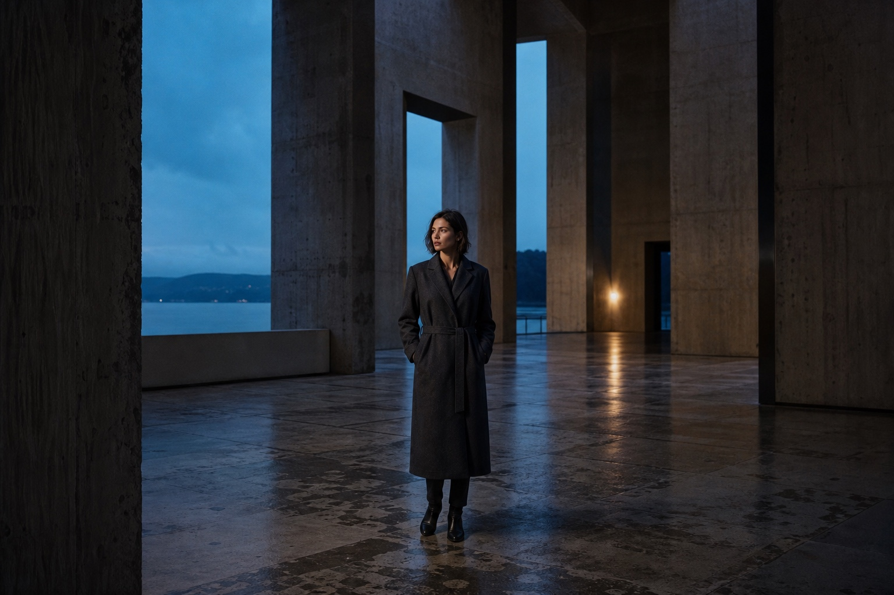

# NODAL: the build sequence

Ten prompts. Paste them into Claude Code in order, in an empty folder. At the
end you have the page.

Each prompt below has three parts:

- **What this actually does** — the plain-language version, for when you want
  the summary before the detail.
- **The prompt** — copy the whole fenced block. It is long on purpose. Every
  number in it is one that cannot be invented without the page feeling wrong.
- **Check** — what you should be looking at before you move on. If you are not
  looking at that, paste the difference straight back at Claude Code.

## What this will and will not give you

Read this before you start, because it sets the right expectation.

**What is guaranteed.** Every element of the original page will be there. The
lens generated from its prescription, all seven chapters, the camera moving
through them, the explode, the ray trace, the light and dark grounds, the
opening, the aperture cursor, the hover cards, the transitions. The page will
look like the same page and it will feel like the same page.

**What is not guaranteed.** It will not be a pixel-for-pixel duplicate, and
nobody should tell you it can be. You are directing a model, not running a
build script. Two people pasting these same prompts will get slightly different
spacing, slightly different material settings, a headline that breaks in a
different place. Expect to spend a little time nudging things afterwards. That
is normal and it is not a failure.

Anyone who tells you an AI will reproduce a design exactly from a description
is selling something. What it WILL do is get you somewhere in the same room,
fast, and the last 5% is where you come in.

**If you want the exact page**, the reference build is public and you can clone
it, run it, and read every line:

    github.com/Sam1983Aing/nodal

Use it to study the code, and use these prompts to learn how the thing gets
built. They are answering two different questions.

## Why the prompts are this long

Two people running the same ten prompts get different code. That is fine for
material choices and easing feel. It is not fine for file names, the layer
order, or the twenty-odd tuned numbers that make the choreography land, because
prompt 7 is written assuming prompt 5 produced `conductor.js`, and prompt 9
assumes the explode finishes where prompt 7 put it.

So: anything that must not drift is pasted in. Anything that can drift is left
alone deliberately.

## Before you start

- An empty folder, and Claude Code open in it
- `node --version` — anything current
- `python3 --version` — for the local server. ES modules will not load off
  `file://`, so a server is not optional
- A browser

Reference build: `github.com/Sam1983Aing/nodal`. If you end up somewhere very
different, that is the diff target.

---

# Prompt 1 — The brief

**What this actually does**

Writes one file that every later prompt reads first. It is the thing that keeps
ten separate conversations building the same project instead of ten variations
on it. Nothing gets built in this step.

```
Create a file called CLAUDE.md in this empty folder. Do not create anything
else and do not build anything yet.

Write it with exactly this content:

# NODAL — build notes

A scroll-driven landing page for a 40mm T1.9 cine prime. The lens is NOT a
model file. There is no GLB, no OBJ and no reference photograph. The object is
generated at runtime from an 18-row optical prescription, and the ray paths,
the barrel, the glass shapes and every number printed in the copy are all
solved from that same table.

## Stack
- Vanilla JS, ES modules, no build step, no npm install
- three.js r185, vendored into `vendor/`
- Lenis 1.3.26, vendored into `vendor/`
- Martian Mono from Google Fonts, the only typeface on the page
- `python3 -m http.server` to run it. That is the only tooling.

## Files, and the arrows only point one way
    main.js  ──▶ lens3d.js ──▶ optics.js
    main.js  ──▶ conductor.js

- `optics.js` is pure maths. It must NEVER import three.js, because it has to
  run in Node. This is what makes the first stage verifiable before a single
  pixel exists.
- `conductor.js` turns scroll into one number. It knows nothing about lenses.
- Nothing points back up the chain.

## The four rules
1. **Absolute, never incremental.** Every scroll-driven value is a pure
   function of scroll position. Nothing accumulates, nothing gets undone.
   Scroll back up and the lens reassembles bit for bit.
2. **A chapter states what it wants to SEE, never where the camera is.** It
   declares a direction, a focal length, how much air to leave and what to
   frame. The camera solves its own distance every frame from the real
   bounding box. That is why it reframes correctly when the lens explodes to
   three times its length, and why it needs no tuning at any window size.
3. **One requestAnimationFrame loop.** Lenis is driven from the render loop and
   nowhere else. A second rAF calling `lenis.raf` is the classic stutter.
4. **Comment the why, not the what.** If a number is non-obvious, say what
   broke without it.

## Conventions
- `U = 0.1` — one world unit is 10mm.
- Millimetres inside optics.js, world units everywhere else.
- No CSS framework, no animation library, no state library.
- Never add a dependency without being asked.

## How to work with me
- **Run things yourself.** Download the files, start the server, run the
  checks. Do not print a command and wait for me to run it. The only time to
  hand me something is when it needs my eyes: looking at the page, or deciding
  how something should feel.
- **Show me the output.** When a step has a check, run it and paste what it
  printed. I want to see the real numbers, not "it works".
- **Do not round a number to make it agree with what I asked for.** If it
  comes out wrong I want to see it wrong.
- Keep the dev server running between steps rather than restarting it.

After writing the file, stop.
```

**Check:** one `CLAUDE.md`, nothing else in the folder.

---

# Prompt 2 — The lens on paper

**What this actually does**

Builds the lens as pure maths, with no browser and nothing to look at. It writes
down the eighteen glass surfaces, then writes a ray tracer that bends light at
every one of them using Snell's law, then solves for the focal length, the
aperture and where the image lands.

The reason this is first: it is the only stage with an objectively right answer.
At the end it prints a number that nobody typed in, and that number proves the
whole idea works before we have drawn anything.

```
Read CLAUDE.md first.

Build `src/optics.js` plus a Node harness `check.mjs` and a `package.json` with
"type": "module". No three.js, no browser, no DOM anywhere in this step.

## The glass catalogue

Export `GLASS`. `n` is the refractive index at the d-line (587.6nm), `v` is the
Abbe number. `tint` is the faint body colour of the glass when it is rendered
with a real transmission pass, `tintDark` is the deeper stand-in used when that
pass is too expensive, and `coat` is the colour its anti-reflection coating
flares. Those three are the only place the palette is allowed to get chromatic.

  key  name      n       v      tint      tintDark  coat
  AIR  air       1.0     null   null      null      null
  LAK  S-LAL18   1.7292  54.7   0xdfeef2  0x24424e  0x6fd0e8
  LAF  S-LAH64   1.7880  47.4   0xd9ecf4  0x203c4c  0x8fb4e0
  SF   S-TIH14   1.7618  26.5   0xf2e6d8  0x4a3c2a  0xd8a35c
  BAF  S-BAH11   1.6668  48.3   0xe4f0f0  0x25454a  0x7fc8d8
  FK   S-FPL51   1.4970  81.5   0xeef6f8  0x2b4c56  0xb0e4ee

## The prescription

One row per optical surface, front to back. `r` = radius of curvature in mm
(null = flat), `t` = axial distance from this surface's vertex to the next,
`g` = the medium AFTER this surface.

   1  r  282.333  t   4.668  LAF    element 1
   2  r  195.209  t   6.866  AIR
   3  r -443.298  t  10.336  BAF    element 2
   4  r -213.700  t   6.384  AIR
   5  r   29.340  t   4.190  LAK    element 3
   6  r  103.500  t   0.100  AIR
   7  r   15.680  t   6.290  LAK    element 4  ┐ cemented
   8  r -143.400  t   1.680  SF     element 5  ┘ doublet
   9  r   11.270  t   7.430  AIR    ← the aperture stop sits in this gap
  10  r  -12.580  t   1.680  SF     element 6  ┐ cemented
  11  r   64.400  t   5.030  LAK    element 7  ┘ doublet
  12  r  -18.080  t   0.100  AIR
  13  r   71.100  t   3.350  LAK    element 8
  14  r  -38.000  t   0.250  AIR
  15  r   84.483  t   3.000  SF     element 9
  16  r  153.205  t   0.250  AIR
  17  r  151.442  t   3.000  FK     element 10
  18  r -234.491  t   0.000  AIR

Ten elements in eight groups. Two surfaces with glass between them form an
element. Where one element's rear surface is immediately the next element's
front surface with no air gap between them, they are a cemented doublet and
must stay together as one group.

The layout is a double-Gauss core (surfaces 5 to 14, the ancestor of nearly
every fast prime) with a gently converging front group ahead of it for
coverage, and a negative/positive rear pair behind it acting as a field
flattener.

DO NOT add semi-diameters to this table. How wide each piece of glass has to be
is not a matter of taste, it is a consequence of where the light actually goes,
so it gets solved further down by tracing the marginal and chief rays and
measuring them. Authoring those numbers by hand produces elements whose two
surfaces cross before they reach the rim.

## Design targets

  STOP_AFTER            9       1-based index of the surface the stop follows
  STOP_FRACTION         0.48    how far across that air gap it sits
  TARGET_EFL            40.0    mm, what the finished lens must measure
  TARGET_FNUMBER        1.8     what the stop is solved to deliver
  HALF_FIELD            15.5    degrees, half the diagonal angle of view
  COATING_TRANSMISSION  0.996   per air/glass surface

## What to implement

- `sag(h, r)` — how far the surface has moved along +Z by height h. Write it in
  the numerically stable form so it stays exact near the axis and never
  subtracts two nearly-equal numbers.
- `refract` — vector Snell at a surface normal. Return null on total internal
  reflection rather than producing NaN.
- `intersectSurface` — ray against the sphere. Of the two roots, take the one
  that lands nearest the surface vertex. That choice is what makes it work for
  both signs of r without a special case.
- `resolve(surfaces)` — vertex z for each surface, plus the index before and
  after it.
- `trace(surfaces, y0, z0, dy, dz, endZ, opts)` — meridional trace, refracting
  at every sphere. Return the path, the height at each surface, and the exit
  ray. A ray whose height exceeds a surface's solved semi-diameter is
  VIGNETTED: stop the polyline there and mark it failed, because that is
  exactly what a real lens does to it. Accept `opts.noVignette` for the
  solvers below, which run before the semi-diameters exist and are searching
  rather than imaging.
- `solveEFL` — trace a near-axis ray parallel to the axis and measure the exit
  angle.
- `solveBFD` — where that ray crosses the axis, relative to the last vertex.
- `scalePrescription(raw, target)` — multiply every r and every t by one
  factor so the traced focal length lands exactly on TARGET_EFL. A uniform
  scale is the one transform that changes a prescription's focal length while
  preserving its behaviour exactly.
- `solvePrescription(raw)` — the whole pipeline, in the only order it can run
  in: scale to the target focal length, solve the stop that delivers the
  f-number, measure how wide every element has to be, then write those widths
  back onto the surfaces. Export `SURFACES` as its result. From that point on,
  `trace` knows what the lens can actually pass.
- `stopPlaneZ` — vertex of STOP_AFTER plus STOP_FRACTION of its air gap.
- `solveStopRadius(surfaces, fNumber)` — the entrance pupil semi-diameter is
  EFL / (2 × fNumber). Trace a ray at that height and measure where it crosses
  the stop plane. Export `STOP_RADIUS` and `STOP_Z`.
- `aimThroughStop(surfaces, angleDeg, targetY)` — bisection on the entry height
  so a ray at that field angle crosses the stop at that height. This is how
  chief and rim rays get found.
- `solveSemiDiameters` — trace a fan across the pupil at 0, 0.7 and 1.0 of the
  field, take the maximum height reached at each surface, add a small rim
  margin. Then shrink any element whose two surfaces would cross before
  reaching that rim, which is the exact failure that authoring these numbers
  by hand produces. Check it with `edgeThickness`: axial thickness at the rim,
  and it must stay positive.
- `solveFocus(surfaces, maxHeight)` — the plane that minimises RMS spot size,
  and the spot size there. Sample the pupil with at least 40 rays spread
  symmetrically across it, entering PARALLEL to the axis at heights up to
  `maxHeight`, then search for the plane minimising sqrt(mean(y²)).

  Pass the ENTRANCE PUPIL semi-diameter as `maxHeight`, which is
  EFL / (2 × f-number) = 11.11mm. Do NOT pass the stop radius: that is
  measured at the stop plane, not at the entrance, and it is about half as
  wide. Sampling with it quietly reports the spot for a bundle the lens is not
  actually working at, and the number comes out below the diffraction limit,
  which should be the tell that something is wrong.
- `lastVertexZ`, `buildElements`, `buildGroups`, `elementProfile(el, steps)`,
  `edgeThickness`.
- `specSheet()` — assemble everything the page will print: efl, fNumber, tStop,
  elements, groups, surfaces, airGlassSurfaces, transmission, frontDiameter,
  bfd, imageCircle, halfField, focusZ, focusRMS, glassTypes.

T-stop is the f-number divided by the square root of the total transmission,
which is COATING_TRANSMISSION raised to the number of air/glass surfaces. That
difference between the geometric f-number and the photometric T-stop is the
whole reason cinematographers use T-stops.

## check.mjs

Print a readable spec sheet. Then trace a ray at a 10 degree field angle
through the stop, and print where it lands next to the ideal 40 × tan(10°).

Run it yourself with `node check.mjs` and paste the output.

Do not round anything to make it agree. If a number comes out wrong I want to
see it wrong.
```

**Check:** `node check.mjs` should print, near enough:

    Focal length          40.000 mm
    T-stop                T1.86
    Transmission          93.79 % over 16 air/glass surfaces
    Elements              10 in 8 groups, 18 surfaces
    Back focal distance   16.800 mm
    Centre spot, RMS      ~3.3 µm
    Image circle          22.19 mm

    Traced 10° chief ray  7.030 mm
    Ideal 40 × tan(10°)   7.053 mm
    Difference            -0.023 mm   (-0.32 % distortion)

Nobody typed any of those. The focal length landing on 40.000 is the scale
solver doing its job, so it is satisfying rather than surprising.

The one to stop on is the last block. The traced ray lands at 7.030 where a
perfect lens would put it at 7.053, and that 0.3% gap IS the lens's
distortion. It was never entered anywhere. It fell out of eighteen rows of
radii and a few dozen lines of Snell's law.

If your spot size is much under 3 µm, check that `solveFocus` is sampling to
the entrance pupil semi-diameter and not to the stop radius.

---

# Prompt 3 — First glass

**What this actually does**

Puts one piece of glass on screen. It takes the profile of a single element from
the maths we just wrote, spins it around the axis to make a solid, and gives it a
material whose index of refraction is the exact same number the ray tracer
refracted with. So the picture and the physics are quoting the same glass.

The trap in this step is worth waiting for. Glass needs something to reflect and
refract, and if you do not build it a room to stand in, it renders as a grey blob
and it looks like the material is broken.

```
Read CLAUDE.md first.

Vendor the dependencies, then get one element on screen.

## Vendoring — do this yourself, do not ask me to install anything

Create `vendor/` and download these three files into it. Run the commands, do
not print them for me to run. There is no npm install, no package to add, and
nothing loaded from a CDN at runtime.

    curl -L -o vendor/three.module.js https://cdn.jsdelivr.net/npm/three@0.185.0/build/three.module.js
    curl -L -o vendor/three.core.js   https://cdn.jsdelivr.net/npm/three@0.185.0/build/three.core.js
    curl -L -o vendor/lenis.mjs       https://cdn.jsdelivr.net/npm/lenis@1.3.26/dist/lenis.mjs

BOTH three files are required. `three.module.js` is only the public surface: it
re-exports from `./three.core.js`, which is where the actual engine lives.
Downloading just the first one gives you a file that looks right, is 650KB, and
fails to resolve the moment anything imports from it.

Then verify before going any further, and tell me the result:

    grep -c "REVISION = '185'" vendor/three.core.js     → must be 1
    grep -c 'version = "1.3.26"' vendor/lenis.mjs       → must be 1
    ls -l vendor/                                        → roughly 1.4MB, 650KB, 33KB

If any of those is wrong, the file did not download properly — usually an HTML
error page saved under a .js name. Delete it and try again rather than carrying
on.

Add an importmap in `index.html` mapping "three" to "./vendor/three.module.js".

## index.html

Minimal for now: a full-bleed `<canvas id="stage">`, the importmap, and a module
script pointing at `src/main.js`.

## The renderer

  WebGLRenderer: antialias true, alpha false, powerPreference high-performance
  toneMapping           ACESFilmicToneMapping
  toneMappingExposure   1.42
  outputColorSpace      SRGBColorSpace
  PerspectiveCamera     fov 32, near 0.05, far 400

## The studio environment — build this BEFORE the material

Without `scene.environment`, every metal renders near-black and every piece of
glass renders like grey plastic. Write `makeEnvironment(renderer, plate = 0)` in
`src/lens3d.js`:

- Draw a 256 × 128 canvas. Equirectangular convention, so v = 0 is straight up
  and v = 1 is straight down. The bottom of the canvas is the floor.
- A vertical gradient with these stops, interpolating between the plate-0 (dark
  studio) and plate-1 (warm paper) colour at each:

    0.00  ceiling   [ 22, 29, 37]  →  [ 42, 48, 56]
    0.40            [ 57, 69, 79]  →  [ 85, 96,106]
    0.58  horizon   [ 74, 88, 99]  →  [110,122,132]
    0.78            [ 29, 36, 43]  →  [156,150,138]
    1.00  floor     [ 11, 14, 18]  →  [207,198,180]

- Then five softboxes composited with globalCompositeOperation 'lighter', each
  a radial gradient scaled into an ellipse, with a falloff at the ends so they
  read as objects in a room rather than as bands on a sphere:

    centre x, y      radius w, h      peak            tint
    0.50, 0.42       0.66w, 1.15h     0.55 - 0.25p    rgba(176,198,220)
    0.26, 0.28       0.30w, 0.52h     1.00 - 0.35p    rgba(255,255,255)
    0.70, 0.34       0.13w, 0.34h     0.72 - 0.22p    rgba(206,232,250)
    0.95, 0.52       0.06w, 0.52h     0.95 - 0.30p    rgba(255,232,196)
    0.04, 0.58       0.05w, 0.50h     0.80 - 0.25p    rgba(150,206,236)

  (p is the plate, 0 to 1. The key softens as the paper's bounce takes over.)

- Run it through PMREMGenerator and return the render TARGET, not its texture.
  `pmrem.dispose()` frees the generator's scratch resources but not the target
  it handed back, so rebuilding the environment later and disposing only
  `.texture` leaks a target every time. The caller disposes this.

Broad soft gradients are what make glass look like milk. This canvas costs
nothing and it is doing most of the work of making the render look expensive.

## One element

Use **element 4**, the fat biconvex out of the front cemented doublet. The
front element of this design is a nearly flat meniscus and renders as a glass
plate, which proves nothing about the material.

Frame it to fill roughly 60% of the frame height. Sit it on the origin so it
turns about itself rather than about the prescription's datum.

`makeElementMesh(el, quality)`:

- Sample the element profile from optics.js, map to Vector2 in world units
  (× U), build a `LatheGeometry` with 112 segments and 44 steps, then
  `computeVertexNormals()`.
- Lathe builds around +Y and the optical axis is +Z, so rotate the mesh
  x by π/2.
- `MeshPhysicalMaterial`:
    color                        the glass tint
    metalness                    0
    roughness                    0.015
    ior                          the very same n the ray tracer refracted with
    transmission                 1
    thickness                    el.thickness × U × 1.4
    attenuationColor             the glass tint
    attenuationDistance          1.1
    specularColor                the coating colour
    specularIntensity            1
    envMapIntensity              1.5
    iridescence                  0.34
    iridescenceIOR               1.28
    iridescenceThicknessRange    [210, 300 + (el.id % 5) × 42]
    side                         FrontSide

  The iridescence is the anti-reflection coating modelled as what it physically
  is: a thin film. Interference across its thickness is what makes a real lens
  throw magenta, green and amber back at you from different elements, and it is
  the single thing most responsible for coated glass not looking like blue
  plastic. The thickness varies per element so the stack shows a range of
  coating colours in depth rather than one flat hue.

## For this step only

Add a simple orbit control or just a drag-to-rotate so it can be inspected. No
scroll, no Lenis, no chapters. One element, lit, on a dark background.

Start the server yourself (`python3 -m http.server 8000` in the background),
leave it running for the rest of the build, and tell me the URL to open.
```

**Check:** a single lens element you can drag to turn. It should be DARK — this
is a dark studio, not a lit one, and the lights do not arrive until the next
step. What tells you it is working is not brightness, it is that the curved
surfaces separate from each other, there is a hard specular highlight on the
rim, and the body carries a faint green-to-violet shift across it. That shift
is the coating, and it is the thing a grey blob cannot fake.

Then prove the lesson. Set `scene.environment = null` and look again:

                        with environment    without
    peak luminance            226               9
    chromatic pixels        11.6 %             0 %

The shape is still there. It just catches nothing at all, because transmission
has nothing to refract and nothing to reflect. Put it back.

Worth doing on camera once. It is a two-line change and it is the difference
between a material that looks broken and one that looks expensive.

---

# Prompt 4 — The whole object

**What this actually does**

Builds the rest of the lens. All ten elements in their eight groups, the metal
barrel fitted around whatever shape the glass actually turned out to be, the
nine-blade iris, the two knurled rings with their engraved scales, the gear
teeth and the mount.

Still nothing moves. That is deliberate. If the object is not beautiful sitting
completely still, scroll is not going to save it.

```
Read CLAUDE.md first.

Build the rest of the object in `src/lens3d.js`. Everything static. No scroll,
no chapters, no animation.

## Quality tiers

Gate on the SMALLER viewport dimension, not width. Keying off width alone
switches a merely narrow desktop window down to the cheap path, which is the
one place the glass stops looking like glass.

  narrow = min(vw, vh) < 700
  transmission     !narrow          (small screens fall back to tinted
                                     translucency at opacity 0.30 with the
                                     tintDark colour, which still reads right)
  latheSegments    narrow ? 48 : 112
  latheSteps       narrow ? 20 : 44
  raysPerFan       narrow ? 5 : 9
  dpr              min(devicePixelRatio, 2)

## buildGlassStack(quality)

All ten elements, bundled by cemented group. Structure matters for later steps:

- Each GROUP is a THREE.Group.
- Each ELEMENT inside it gets its own sub-group, so a cemented doublet can
  crack open by a hair during the explode without leaving its group.
- Record for each group: `group`, `parts`, `elements`, `index`, `centreZ`
  (the mean of its elements' centres), `home` (a clone of its untouched resting
  position), `sd` (the max semi-diameter of its elements), `cemented`.

`home` is load-bearing. Every explode later reads from `home` and writes an
absolute position, never an increment, so the motion cannot accumulate drift
and is exactly reversible.

Give every element a thin rim: a `CylinderGeometry` at 1.002 × its semi-
diameter, height `max(thickness × U × 0.55, 0.02)`, near-black
(`MeshStandardMaterial`, color 0x04060a, roughness 1.0, envMapIntensity 0.12,
DoubleSide). Real elements are ground with a fine matte land around the
circumference so the mount has something to grip and stray light does not skip
along the edge. Mark them `userData.rim = true` — the inspector lights these later.

Give that material an `emissive` COLOUR now, around `0x8fb4e0`, with
`emissiveIntensity: 0`. Setting `emissiveIntensity` later on a material whose
emissive colour is still black does exactly nothing, and it is a silent
failure: the inspector will pick correctly, the card will appear, and the glass
simply will not light. You will go looking in the raycaster.

## buildBarrel(spec, quality)

**The glass sets the INSIDE. The outside knows nothing about the glass.**

Machine the bore to clear each element with about 1mm of room, so it necks
steadily toward the rear exactly as the stack does. Then give the OUTER wall a
stepped profile that is stated outright below.

Do not let the outer wall follow the glass envelope. The stack is fat at both
ends and thin at the stop, so an outer wall that follows it comes out as an
hourglass with a waist in the middle. No lens has ever looked like that, and it
is the single thing most likely to make this step feel unfinished.

**Proportion decides whether this reads as a cine prime or as a jar.** About
70mm across and 100mm long, so roughly 1.45 as long as it is wide. Fatter than
about 1.2 and it stops looking like a lens, whatever else is right about it.

(The page's copy says "95mm front". That is a claim about the filter thread
shared across the matched set, not the diameter of this part. Building the
barrel at 95mm gives you something short and fat that is wrong in exactly the
way that is hardest to see when you are looking at it on its own.)

### The outer profile, [z in mm, radius in mm]

    [-9.0, 33.13] [-6.2, 33.13] [-6.0, 33.53] [-1.0, 31.53]
    [ 3.0, 30.33] [ 8.0, 30.33]
    [ 8.4, 33.73] [24.0, 33.73] [24.4, 30.33]     focus ring band
    [30.0, 30.33]
    [30.4, 33.23] [41.0, 33.23] [41.4, 30.33]     aperture ring band
    [77.8, 30.33] [81.8, 27.30] [85.3, 27.30]     step down to the mount

Interpolate linearly between stations. The glass runs from z = 0 to about
z = 79.8, so the barrel starts 9mm ahead of the front element and ends 5mm
behind the last one.

**The two ring bands step OUT, not in.** The rings stand proud of the body. On
a real prime you find them with your hand without looking, and a recessed ring
cannot do that.

### The bore

Whatever the glass needs at each z, plus about 1mm, and never narrower than the
light actually passing through.

Clamp it outside the glass range. Ahead of the front element there is no glass
within sampling distance, so the envelope reads zero and the bore collapses to
the stop radius, burying the front element down a hole a third of its own
diameter. Use the end elements' semi-diameters beyond each end.

### The shell

Build it as ONE closed lathe profile: out along the outer wall, in at the back,
forward along the bore, out again at the front, closing on the first point.
That closes the front face, the rear face and the wall in a single piece, so it
reads as machined metal rather than as a tube with open ends.

Add a machined chamfer on the front lip. One torus, and it does more for
"expensive" than anything else here, because it is the only hard specular line
on an object made entirely of soft ones.

## The two rings

Each band carries, in order along it: an engraved scale on the leading third,
knurling in the middle, and gear teeth on the last fifth.

**Knurling.** Real geometry, not a normal map, because a normal map does not
catch a rake and the rake is the entire point.

The grooves run ALONG the axis, so cut them into the cylinder's SEGMENTS by
displacing vertices radially by angle. Cutting them into the lathe PROFILE
gives you rings around the barrel, which is a thread, not a knurl.

Depth matters more than you would think: about 4% of the barrel radius. At
0.1mm it is geometrically present and completely invisible, which reads as a
smooth black tube.

**Engraved scales**, drawn to a canvas texture. Distances on the focus ring
(∞, 30, 12, 8, 6, 5, 4, 3.5, 3, 2.5, 2, 1.5), T-stops on the aperture ring
(1.9, 2.8, 4, 5.6, 8, 11, 16, 22), with a half-stop tick between neighbours.

ROTATE EACH LABEL A QUARTER TURN when you draw it. The texture's u axis wraps
around the barrel, so text drawn the obvious way ends up lying on its side once
it is on the cylinder. A real scale is engraved to stand upright when the lens
is held horizontally, because that is the only way an operator reads one.

**Gear teeth** as an `InstancedMesh`, 0.8 module.

## The mount

A PL mount at real proportions: a thin flange at 27.3mm radius, NARROWER than
the barrel, a bayonet ring, four locating lugs, and a dark rear cavity so
looking into the back is not looking at a mirror.

Do not make it a disc wider than the barrel. It becomes the brightest thing in
frame and reads as a plate stuck on the end.

The flange is bright steel, around `0x8d939b`, not anodised black. It is the
one light-coloured part on the whole object and it is what stops the rear
reading as a silhouette.

## Material

Anodised aluminium is never actually black. It is a very dark grey that goes
almost white where a light rakes across a machined edge. Around `0x26282d`,
roughness 0.34, metalness 0.90, envMapIntensity 1.5.

Pure black here and every bit of the machining you just built disappears.

Return the ring groups separately (`focusRing`, `irisRing`) and the materials
array — later steps dissolve the whole barrel by opacity.

Also return the sampled profile as `rows`, and put BOTH walls in each row:
`{ z, h, bore }`. The blueprint overlay in step 7 draws the barrel in section,
which means it needs the inside line as well as the outside one. Returning only
the outer radius means going back and rebuilding this later.

## buildIris(quality, blades = 9)

Nine real overlapping blades, not a texture.

DO NOT model the aperture directly. Model each blade as a shape that covers a
half-plane, with its straight inner edge at distance d from the axis, and
rotate N of them evenly about the axis. What they leave uncovered is a regular
N-gon of inradius d, automatically. Closing the iris is then just shrinking d.

That is both how a real iris actually works and the only construction that is
guaranteed to leave a correctly shaped hole. Blade shapes eyeballed as petals
or teardrops seal shut at the centre and give you a solid black disc with no
aperture at all, which is easy to miss because it still looks like blades.

Bow the inner edge very slightly toward the axis. Real blades are curved, which
is what rounds the corners of the aperture, and it is the difference between
bokeh that reads as a lens and bokeh that reads as a nut.

Stagger the blades slightly in z so neighbours never z-fight where they overlap.

**Size the blade to the bore, not to the barrel.** It only has to cover the
hole. Reach out about `R × 1.7` and make it about `R × 1.15` wide, where R is
the solved stop radius in world units.

Reaching much further is the kind of mistake that hides for three steps. Inside
an assembled lens nobody can see how big the blades are, so an oversized iris
looks completely fine here — and then the stack pulls apart in step 7 and there
is a wide opaque disc sitting in the middle of your exploded view. Get it right
now, because you will not be looking for it later.

Export `setIris(iris, t)`, t = 0 closed, t = 1 wide open, with
`d = R × (0.06 + 0.94 t)` where R is the solved stop radius in world units.
Add a small blade rotation as it stops down: small, but it is the motion the
eye recognises.

Expose `iris.blades` — later steps read the blade count rather than
hard-coding 9. Position the group at `STOP_Z × U`.

## Lights

  key      DirectionalLight 0xffffff, 1.9,  at ( 6,  7, -4)
  fill     DirectionalLight 0xc3d4e2, 0.5,  at (-7, -2,  5)
  bounce   DirectionalLight 0xffe4c0, 0.15, at ( 0, -8,  2)

A whisper of direct light on top of the environment, purely to put a hard
highlight on the barrel edge that an environment map alone cannot give. The
bounce is light coming back up off the page: near zero on a black ground,
strong on paper.

## Assembly

Add glass, barrel and iris to one `lens` group. Then nest three transform
groups around it, outermost first:

  tilt  →  drag  →  spin  →  lens

Scroll will own one of them, the pointer another, the hand the third, so none
of them can ever overwrite another. Add `tilt` to the scene.

Centre the object on its own glass: `lens.position.z = -lastVertexZ(SURFACES) / 2 × U`,
so rotation happens about the lens rather than about the origin of the
prescription.

Keep the drag-to-rotate from the last step so it can be inspected.

## Where to put the camera for this step

A three-quarter from -X, slightly above: direction roughly
`(-0.88, 0.22, -0.42)` normalised, framed to fill about 85% of the frame.

Do not leave it looking down the axis. Dead-on, the barrel hides entirely
behind the front element and you are judging a glass disc, which is exactly the
thing that cannot tell you whether this step worked.
```

**Check:** a complete cine lens, sitting still, that you can drag to turn.
Front element, barrel, two knurled rings with gear teeth, a mount flange at the
back. It should look like a photograph of an object rather than a render of a
shape.

Two things the check cannot see from outside, so verify them directly.

**The iris.** Hide the glass and the barrel, point the camera down the axis,
and step `setIris(iris, t)` through 0, 0.25, 0.5, 0.85, 1. The hole should grow
monotonically and be a clean nine-sided polygon at every step:

    t = 0.00   sealed
    t = 0.25   small
    t = 0.50   about half
    t = 1.00   wide, its edge at the stop radius

If it is sealed at every value of t, the blades are the wrong shape. See the
half-plane note above. Put the glass and barrel back afterwards.

**The engraved scales.** Confirm the ring material actually has a `map` on it.
The numbers are legible when a ring faces the light, and invisible otherwise,
so "I cannot read them" is not evidence either way at this stage.

Spend time here. Everything after this is choreography, and choreography cannot
rescue an object that does not already look made.

---

# Prompt 5 — The scroll spine

**What this actually does**

Turns the whole page's scroll position into a single number. Not a timeline, not
a list of triggers. One number that says where you are along the route: 0 at the
top, 6 at the bottom, 2.35 somewhere in the middle of the third chapter.

Everything in the rest of the build is a function of that one number, which is
what makes the whole thing reverse perfectly when you scroll back up.

This step looks like nothing on screen. It is the most important one in the
build.

```
Read CLAUDE.md first.

Build `src/conductor.js` and wire Lenis in. Nothing about lenses belongs in
this file.

## Sections

Add seven empty `<section data-chapter>` elements to index.html, each with a
`data-label` and its own class.

**They are NOT all the same height.** Each chapter is given exactly as much
scroll as it has work to do, and every timing window later in the build is
calibrated against these numbers. Equal-height chapters will produce a page
where everything technically happens and nothing lands.

    class               label              min-height
    chapter--hero       (no label)         100svh
    chapter--object     01 — Rendering     200svh
    chapter--beat       02 — The cost      150svh
    chapter--explode    03 — Inside        320svh
    chapter--trace      04 — Proof         230svh
    chapter--series     05 — The set       180svh
    chapter--end        06 — Order         130svh

The explode gets 320svh because it is the long scrub and it is the reason
anyone is on the page. The hero gets 100 because it has already said what it
has to say.

Use `svh`, not `vh`. On mobile, `vh` is the tallest the viewport ever gets, so
a `100vh` section is taller than the screen for as long as the browser chrome
is showing, and every anchor is measured against a viewport height that is not
on screen.

Also required, and both will cost you an hour if you get them wrong:

    .chapter   display BLOCK, not flex
               A flex chapter centres its sticky pad inside the tall section,
               which parks the pad hundreds of pixels down the viewport and
               stops `position: sticky` from ever pinning at all.

    main       pointer-events: none, with interactive children opting back in.
               Otherwise the copy layer swallows every event and the object
               underneath cannot be grabbed anywhere a chapter covers it.

## Conductor

A class taking the section list. Measure an anchor per section:

  anchor = rect.top + scrollY + rect.height × 0.5 - vh() × 0.5

Then `read(dt)` converts document scroll into a fractional chapter by finding
which pair of anchors the scroll sits between and interpolating. Expose one
state object:

  exact         fractional chapter, e.g. 2.35, undamped
  smooth        damped:  smooth += (exact - smooth) × (1 - exp(-5.4 × dt))
  index         Math.round(exact)
  next          floor(exact) + 1
  localExact    exact - floor(exact)
  localSmooth   smooth - floor(smooth)
  direction     sign of the last real scroll delta
  progress      0..1 across the whole route
  speed         |scroll velocity| in viewport heights per second
  signedSpeed   the same, signed
  jolt          one-frame spike when speed changes abruptly

Low-pass the velocity at `min(1, dt × 14)` before taking its absolute value. A
trackpad's deltas are spiky and unfiltered they read as a hundred separate
jolts.

Guard every measurement: some embedded and headless viewers report a zero-height
window before their first real layout, and one division by that poisons the
whole state with NaN. Export `vw()` and `vh()` helpers that fall back through
`innerWidth` / `documentElement.clientWidth` / a probe element / a constant.

Add a `force(progress)` test hook that drives the conductor without a real
scroll event, and a `hold` override that pins `exact` to a fractional chapter.

## Helpers, exported from the same file

  clamp, lerp, smoothstep, smootherstep
  monotone(values, t)   monotone interpolation across an array of scalars,
                        smootherstep between neighbours. Deliberately NOT
                        Catmull-Rom: the overshoot would let a value travel
                        backwards while the visitor scrolls forwards.

## Lenis

  duration          1.35        heavy and deliberate
  easing            t => min(1, 1.001 - 2^(-10t))
  smoothWheel       true
  wheelMultiplier   0.92
  touchMultiplier   1.5

Hide the native scrollbar.

## The one loop

One requestAnimationFrame. Inside it, in this order: `lenis.raf(now)`, then
`conductor.read(dt)`, then render. Clamp dt to 0.05 so a background tab does not
produce one enormous frame.

Do NOT give Lenis its own rAF. That is the classic way to make a page like this
stutter.

## For this step only

Print `exact` and `smooth` in a fixed corner of the screen, to three decimal
places. Nothing else is wired yet.
```

**Check:** scroll. The number climbs 0 → 6 and comes back down cleanly, and
`smooth` lags `exact` slightly then catches up when you stop.

Now the part that matters, and it is the reason this step exists.

**A chapter does not begin at its own integer.** Print the value of `exact` at
the moment each chapter's pad stops rising and pins, and you get this:

    chapter            pins at   unpins at
    0  hero            0.000     0.000
    1  01 Rendering    0.667     1.286
    2  02 The cost     1.857     2.106
    3  03 Inside       2.532     3.400
    4  04 Proof        3.764     4.317
    5  05 The set      4.805     5.258
    6  06 Order        5.903     6.000

Chapter 2 pins at **1.857**, not 2.0. Chapter 3 pins at **2.532**.

The reason is worth saying out loud, because it looks like a bug and is not.
The anchors are section CENTRES, but a sticky pad pins at the section TOP. With
chapters of different heights, the distance between those two points is
different for every chapter. So the fractional value at which a chapter
actually arrives is a number you have to measure, not one you can reason to.

Every window in the next two steps is written against these measured values.
Aim one at the round integer instead and it fires while the previous chapter is
still on screen, or hundreds of pixels after the pad has already locked. It
will look like a broken observer and you will go looking in the wrong place.

Measure your own now and write them down. If yours differ from the table
above, your section heights are wrong.

---

# Prompt 6 — The camera that solves itself

**What this actually does**

The camera never gets told where to go. Each chapter writes down what it wants
to see: which side to look from, how long a lens to use, how much air to leave
around the object, and which part of it to frame. Then every single frame the
camera works out its own distance by fitting the object's real bounding box to
the real window.

That is why it reframes correctly when the lens later explodes to three times its
length, and why it needs no tuning on a phone.

There are two completely different reasons a camera looks like it jumps, and only
one of them is about position. Both show up in this step.

```
Read CLAUDE.md first.

Build the camera system in main.js. The camera reads `smooth`, never `exact`.

## The chapter ledger

An array, one row per chapter. Each row declares a viewing DIRECTION, a field of
view and how much air to leave. Never a position.

  id       dir                    fov  pad   frame   shift  lift   liftP  padP  ease    extra
  hero     0.46,  0.28, -0.84     26   1.24  front    0.12   0.06   0.50  2.10  settle  dirLag 0.40
  object  -0.97,  0.20,  0.14     30   1.52  whole    0.42   0.05   0.74  2.35  plate
  beat    -0.82,  0.13, -0.56     26   2.05  whole    0.00   0.34   0.34   —    reveal
  explode -1.00,  0.09,  0.00     26   1.14  glass    0.00  -0.02  -0.16   —    glide   hold 0.58
  trace   -1.00,  0.00,  0.00     25   1.74  trace    0.36   0.10  -0.52   —    plate
  series  -0.70,  0.30, -0.65     30   1.22  stable   0.38   0.00  -0.70  2.35  glide
  end     -0.92,  0.05, -0.39     30   1.22  stable   0.00  -0.49  -0.66   —    reveal

- `dir` points FROM the object TO the camera.
- From chapter 1 onward the camera sits on -X. That is not a taste call: with
  the camera on -X the optical axis (+Z) runs left-to-right across the screen,
  so the light in the trace chapter travels the way a reader expects a diagram
  to be read. On +X the whole sequence runs backwards.
- `shift` is where the object sits across the frame, -1 hard left to +1 hard
  right. `lift` is the same vertically. They exist so the object and the copy
  never fight for the same part of the screen.
- `padP` and `liftP` are the portrait values. They are separate numbers rather
  than one global nudge because the copy does not go to the same place in a
  portrait frame for every chapter: most move it to the lower third, the trace
  and the explode keep it at the top, the series sits across the middle. One
  blanket portrait offset put the object on top of the copy in half of them.
- **The hero's `pad` and `shift` are worth checking against your own object.**
  They frame the front element, but how much barrel recedes behind it depends
  on how long yours came out. The object should sit in the channel between the
  two copy columns with comparable air on each side. If it crowds the headline,
  raise `pad` a little and nudge `shift` up.
- **`lift` on the closing chapter is the one value in this table that is tuned
  to your object's LENGTH.** Standing the lens up turns its long axis vertical,
  so where the framed box centres depends on how long your barrel came out. The
  value above suits a 101.5mm lens. If yours is shorter it will overshoot and
  crop the bottom of the standing lens. Check that chapter specifically and
  adjust this one number until the whole object sits inside the frame. Nothing
  else in the ledger needs touching.
- The hero is a front-led three-quarter, not dead-on. A full-frame close-up of
  the front element was tried and abandoned: every bit of this object that reads
  as expensive is manufactured detail, and framing tight on the glass excludes
  all of it and asks a procedural material to carry the whole frame alone.

## framing(name) — five named boxes

Return a CENTRE and HALF-EXTENTS, not a bounding sphere. A sphere that
circumscribes this layout is dominated by its length, so the object would sit
tiny in a wide frame.

  front    the front element only, plus half a radius of air
  glass    live bounds of the glass stack
  trace    stated outright, not measured: it runs from where the rays are
           launched (RAY_START) to the focal plane the solver found
  stable   a box captured ONCE at rest, before the first render, with the
           barrel on and the rays already hidden
  whole    live bounds of the whole lens

For the captured box, use `lens.matrix`, deliberately, NOT `matrixWorld`. The
ancestors above `lens` are the idle drift, the pointer parallax and whatever the
visitor has dragged. Transforming an axis-aligned box by a rotation inflates it,
because the box grows to contain the rotated corners, so feeding matrixWorld in
makes the framing breathe with the idle spin.

Write `visibleBounds(root, target)` that skips hidden subtrees, and use it for
the capture.

## distanceForBox — exact fit, any direction

For a corner at offset o from the centre, a camera at distance d sees it at
depth (d - o·dir) and lateral offset (o·right). Requiring the corner to sit
inside the frustum gives:

  d >= |o·right| / tan(hFov/2) + o·dir

and the same for the vertical. Take the largest over all eight corners. That is
the smallest distance containing the whole box, with no diagonal padding
guesswork. Multiply by `pad`.

## Per frame

  i      = floor(clamp(smooth, 0, 6))
  A, B   = CHAPTERS[i], CHAPTERS[i+1]
  held   = A.hold ? clamp((clamp(smooth-i,0,1) - A.hold) / (1 - A.hold), 0, 1)
                  : clamp(smooth-i, 0, 1)
  f      = EASE[A.ease](held)

  centre, half, fovBase, pad   all lerp A→B by f
  dirT   = A.dirLag ? EASE[A.ease](clamp((held - A.dirLag)/(1 - A.dirLag),0,1)) : f
  dir    = slerp(A.dir, B.dir, dirT)

  solved  = distanceForBox(half, dir, right, up, fovBase, aspect, pad × portrait)
  camDist += (solved - camDist) × (1 - exp(-2.2 × dt))

- `hold` parks the camera on THIS chapter's framing for the first part of its
  span. The explode needs it: the stack finishes opening a third of the way
  through the chapter, and without a hold the camera immediately starts
  travelling, so the fully-open view is never actually still.
- `dirLag` exists because translation and rotation do not have to share a clock.
  Delaying the swing lets the hero pull straight back off the front element
  before the camera starts travelling around the barrel, so it reads as one move
  then another rather than a camera doing two things at once.
- Use SLERP, not lerp-and-renormalise. Lerping two unit vectors traces a chord
  across the sphere, not an arc, so the angular velocity is wrong throughout and
  worst on the long swings, which is exactly where the eye notices. Fall back to
  lerp when the two directions are within 0.9995 and the arc is unstable.
- Damp the distance SLOWER than the chapter value (2.2 against the conductor's
  5.4) so the camera arrives after the move rather than chasing it. The fit is
  re-solved every frame from live bounds, so while the glass separates the
  target distance grows continuously; following it directly makes the camera
  creep and never hold still, which is most of what reads as unpolished.

## Basis and pan

`dir` points from the object to the camera, so the camera's own right vector
comes from the VIEW direction, which is its negation. Crossing with `dir`
instead gives camera-left and silently mirrors every shift.

  viewDir = -dir
  right   = viewDir × camera.up,  normalised
  up      = right × viewDir,      normalised

Pan, do not re-aim. Offset the camera AND its look-at point by the same vector.
That slides the object across the frame while keeping it square to the lens.
Offsetting only the look-at would skew it.

  visH   = 2 × dist × tan(fov/2)
  visW   = visH × aspect
  shiftX = portrait ? 0 : -lerp(A.shift, B.shift, f) × visW × 0.5
  lift   = portrait ? lerp(A.liftP, B.liftP, f) : lerp(A.lift, B.lift, f)
  pan    = right × shiftX  +  up × (-lift × visH × 0.5)

  camera.position = centre + dir × dist + pan
  camera.lookAt(centre + pan)

A portrait frame steps BACK rather than cropping sideways:
`portrait = aspect < 1.15 ? clamp(1.15/aspect, 1, 1.5) : 1`.

## The easing set

Three curves with different body language. A page where every transition shares
one easing has no personality, whichever easing it happens to be.

  reveal   t => 1 - 2^(-10t)                      out-curve
  settle   back-out, s = 0.55, ~3% overshoot      enough for a heavy camera to
                                                  arrive and settle, not enough
                                                  to read as a bounce
  glide    smootherstep: t³(t(6t - 15) + 10)      zero velocity at BOTH ends
  plate    exponential in-out

RULE: any chapter carrying a `hold` MUST use `glide` to leave.

Here is why, and it is the best lesson in the build. `reveal` and `settle` are
out-curves: their derivative at t=0 is 6.9 and 3.55. That is right when the
previous move is still settling and the two overlap. It is wrong when the camera
has been sitting still, which is exactly what a `hold` guarantees. Position is
continuous, velocity is not, and velocity is what the eye reads. On the explode
chapter this went 0.000 to 3.652 in a single frame, 17% of the camera's whole
travel, and it reads as a hard jump.

The OTHER cause of a jump has nothing to do with easing: flipping `visible` on a
mesh changes the bounding box in one frame, so the solved distance steps. That
is what the captured `stable` box is for.

## Resize

On resize: renderer size, aspect, projection matrix, and re-measure the
conductor's anchors.

Keep ONE module-level `aspect` and let the camera read only that. Setting
`camera.aspect` on its own leaves the solver still working in the old shape, so
a landscape window silently keeps using the portrait `liftP` and `shiftX = 0`,
and the object sits in the wrong place with nothing obviously broken.
```

**Check:** scroll through all seven chapters. The camera swings around the
object, pushes in and pulls back. Resize the window narrow and wide and it
reframes on its own, and you never typed a camera position anywhere.

Then verify it properly, because "looks right" is not a measurement. Park the
camera on each chapter in turn, project the eight corners of that chapter's
framed box into normalised device coordinates, and check where the box actually
lands against what the ledger asked for:

    chapter    shift asked   got     lift asked   got
    hero          0.12       0.12       0.06      0.00
    object        0.42       0.45       0.05      -0.01
    beat          0.00       0.00       0.34      0.31
    explode       0.00       0.00      -0.02     -0.08
    trace         0.36       0.39       0.10      0.11
    series        0.38       0.38       0.00     -0.11

Within a few hundredths is right. Zero on every `shift` means you are solving
in portrait: see the resize note above.

**The closing chapter will NOT frame correctly yet, and that is expected.** It
is framed as though the lens were standing upright on its mount, and the
rotation that stands it up does not exist until the next step. Leave it.

**One honest note about smoothness.** Sample the camera's position across the
whole route and look at how much its per-frame travel changes step to step.
There is one real velocity step, early, around `e = 0.39`, worth about 2% of
the camera's total travel. That is the hero's `dirLag` releasing the swing on
an out-curve, and it is in the reference build too. Damping and smooth scroll
hide it in practice. Everything else should be continuous.

Do not try to demonstrate the glide-versus-reveal lesson here. Nothing is
exploding yet, so the glass box never changes size, and swapping the ease
changes the camera's total travel by about 0.005%. That lesson needs the next
step to be visible at all.

---

# Prompt 7 — Taking it apart

**What this actually does**

This is the choreography. The lens pulls itself apart into its ten elements, the
metal barrel dissolves away, three bundles of light get traced through the glass,
and a blueprint outline sketches itself over the top.

Every one of those is written as a pure function of that one scroll number. None
of them remember anything. That is what lets you scroll backwards and watch the
whole thing reassemble exactly, instead of drifting slightly further out of place
every time.

```
Read CLAUDE.md first.

Build the phase system and everything it drives.

## The window function

  win(v, a, b) = smootherstep(clamp((v - a) / (b - a), 0, 1))

Every phase is a window on `e`, the exact fractional chapter. No timeline, no
per-chapter bookkeeping, no triggers, no state.

## phases(e)

  explode     win(e,2.82,3.24) × (1 - win(e,3.62,3.94))
  barrelFade  win(e,2.86,3.20) × (1 - win(e,4.30,4.72))
  blueprint   win(e,3.66,4.10) × (1 - win(e,4.74,5.12))
  rays        win(e,3.80,4.12)
  raysOut     win(e,4.45,4.85)
  iris        win(e,0.55,1.35) × (1 - win(e,1.62,2.15))
  focusRing   win(e,0.6,1.9)
  stand       win(e,5.30,6.00)
  dolly       win(e,1.72,2.00) × (1 - win(e,2.04,2.24))

Those numbers are tuned, not arbitrary. Do not round them. In particular:

- **explode starts at 2.82, not 2.25.** The earlier value had the glass already
  separating while the previous chapter was still making its claim, so the
  headline landed on top of the evidence. The order has to be: statement,
  statement clears, THEN the lens opens into an empty frame.
- **blueprint is held at zero through the whole explode.** The outline is drawn
  in the same plane the separated elements occupy, so over an open stack it
  crosses the glass and runs straight through the labels. The drawing and the
  thing it describes cannot share the frame. It belongs to the trace, where the
  glass is reassembled and the outline is context rather than clutter.
- **barrelFade returns over 4.30–4.72.** Chapter 5 pins at about e = 4.86, so a
  later window leaves the barrel still half-dissolved in the very shot that is
  meant to show the object finished.
- **raysOut must reach a true zero, and early.** A version that only reached
  0.85 left the trace sitting at 15% opacity across the last two chapters.

## Applying them

  setIris(iris, iris × 0.85)
  barrel materials opacity = 1 - barrelFade ;  hide the group above 0.995
  blueprint uOpacity = blueprint ;  uDraw = clamp(blueprint × 1.35, 0, 1)
  rays uDraw = rays ;  uOpacity = 1 - raysOut ;  visible while rays > 0.004
                                                 and raysOut < 0.999
  imagePlane visible when rays > 0.55
  focusRing.rotation.z = -focusRing × 1.1
  irisRing.rotation.z  = -iris × 0.85
  lens.rotation.x     -= stand × (π/2)

`stand` rotates -90° about X, which sends +Z (the optical axis) upward: mount to
the sky, front element down, the way a lens sits on its cap. The other direction
stands it up but reads every engraved number upside down. It is driven from `e`
like everything else, so scrolling back up lays it down again.

## Wire the dolly into the camera you built last step

`dolly` is the one phase that does not drive the object. Pass it into the
camera solve and use it there:

    if (dolly > 0.001) { if (dollyRef < 0) dollyRef = camDist; }
    else dollyRef = -1;

    base = dollyRef > 0 ? lerp(camDist, dollyRef, dolly) : camDist
    fov  = fovBase + dolly × 8
    dist = base × tan(fovBase/2) / tan(fov/2)

Holding the subject the same size requires `dist × tan(fov/2)` to stay
constant, so the reference distance is FROZEN on entry. Read the live damped
distance instead and the fit drifts out from under the compensation while the
move is running.

It lives in the blank beat rather than over the explode because the framing is
already pulling back there to fit the separating glass, so the two would fight
for the same distance and the subject would shrink by a quarter instead of
holding still. The blank beat is the one moment on the page where nothing else
is moving, which is exactly where a move like this can be seen at all.

Remember to recompute `visH` from the DOLLIED fov, not the base one, or the pan
drifts by a few percent whenever the dolly is running.

## applyExplode(t)

  GAP        = 0.62    world units added between neighbouring groups
  CEMENT_GAP = 0.13    how far a cemented doublet cracks open

  group i  →  z = home.z + (i - (n-1)/2) × GAP × t
  part j   →  z = (j - (m-1)/2) × CEMENT_GAP × t
  iris     →  z = STOP_Z × U + (floor(n/2) - (n-1)/2) × GAP × t × 0.5

Every group is written to an ABSOLUTE position derived from its `home`. Never
`+=`, never a delta. Groups keep their order and every air gap grows by the same
amount, which is what an exploded assembly actually looks like. The iris lives
in an air gap and travels with the half in front of it.

## buildRays(spec, quality)

Three bundles: one down the axis, one at two thirds of the field, one at the
corner. Each bundle is 9 rays. Launch them from RAY_START = -34 and trace them
through the real prescription using the same `trace()` from optics.js, so the
line you draw IS the light path rather than an illustration of it.

Draw with a shader carrying `uDraw` (0 to 1, sketches the line on from the front)
and `uOpacity`. Tint the axial bundle cool and the corner bundle warm.

## buildImagePlane(spec)

The trace is a meridional section, a slice through the lens, so the sensor has
to be drawn as one too. A full rectangle floating in space reads as a wall.

## buildBarrelBlueprint(rows, elements)

A line overlay of the barrel profile with leader lines, drawn in the same shader
style with its own `uDraw`. Build it hidden: it defaults to visible and its
leader lines reach well past the barrel, so if it is on when the `stable` box is
captured it inflates that box enough to push a chapter off the frame edge.

## The reversibility test

Add `test/reverse.mjs` or a `window.__nodal` hook that samples 61 positions from
0 to 1 going down, then the same 61 coming back up, records every phase value at
each, and asserts the difference is EXACTLY zero. Not nearly zero. Zero.

Run it on every change from here on. If it ever fails, something is
accumulating.
```

**Check:** scroll into the third chapter. The barrel fades out, the ten
elements draw apart along the axis, the two cemented doublets crack open by a
hair. Keep going and three bundles of light thread through the glass and
converge on the focal plane, then a blueprint sketches itself on over the top.

Park at `e = 3.42` and print the group positions. They should be perfectly
even, one `GAP` apart, symmetric about zero:

    -2.17  -1.55  -0.93  -0.31   0.31   0.93   1.55   2.17

Uneven spacing means something is being written as an increment rather than as
an absolute.

**Look hard at the middle of the exploded stack.** If there is a wide dark disc
sitting between the elements, your iris blades are too big. It was invisible
for the last three steps because it was inside an assembled lens. See the note
in step 4.

**Then run the reversibility test.** Sample every phase at 61 positions going
down, then the same 61 coming back up, and require the difference to be exactly
zero. Then scroll the whole route down and back and compare the glass group
positions with where they started:

    phase samples compared           549
    largest difference                 0
    geometry drift after round trip    0

Not nearly zero. Zero. Anything else means something accumulates, and it will
get worse every time somebody scrolls.

Run it on every change from here on.

---

# Prompt 8 — The page around it

**What this actually does**

Everything that is not the lens. Seven chapters of real copy, the ground
flipping between black and warm paper as you move between them, headlines that
slide up through their own mask, a progress bar along the top edge.

The part worth pointing at: every number printed on this page is read out of the
optical solver. The T-stop, the spot size, the angle of view, the front
diameter. Not one of them is typed in. Change a radius in the prescription and
the copy changes with the glass.

```
Read CLAUDE.md first.

Build the DOM layer and the stylesheet. Martian Mono for everything, variable
width and weight, loaded from Google Fonts.

## The seven chapters, with their copy

CHAPTER 0 — HERO, no chapter label (the mark in the chrome does that job)

  Headline, two masked lines, both at full foreground weight:
      Wide
      open.
  (A dimmed setup line needs a setup word. "Wide open." has no spare word to
  give away, so the value split comes off and the whole thing sits forward.)

  Lede, fading in place — NOT opening from zero height, which shoves the
  headline upward and moves the one fixed thing in the frame:
      The new Series A holds its corners, its contrast and its colour at full
      aperture. There is no reason to close it.

  Right-hand block, eyebrow "The rendering", then a slow vertical ticker,
  masked to nothing at both ends so lines arrive and leave rather than
  appearing and cutting off. Duplicate the list once and travel the track
  exactly -50%, which is what makes the loop seamless:
      Sharp corner to corner, wide open
      Focus that rolls rather than snaps
      Under 1% breathing across the throw
      Colour matched across the set
      Highlights round off, never clip
      Skin keeps its warmth at T1.9
      Bokeh stays round to the frame edge
      No focus shift down to T5.6
      Flare is controlled, never sterile
      Longitudinal colour under 4 µm
      Ten elements in eight groups
      300° throw, geared at 0.8 module
      One front diameter across the set
      Holds contrast in backlight
      Nine blades, round to T8
      Distortion under 0.4% at the corner
      Shimmable at the mount
      1.4 kg, balanced behind the rods

  Foot: two buttons (Order, filled / Datasheet, ghost) sliding out of a clip,
  a thin rule drawn from the centre outward, then a metrics row:
      [tstopFull] Wide open · [rms] Centre spot · 100 % Corner illumination
      · 0.45 m Close focus · PL · LPL Mount

CHAPTER 1 — 01 — Rendering   (paper plate)

      Sharp wide open.
      Never clinical.          ← second line takes the accent

      Wide open at T1.9 it resolves detail you can still grade, then lets go of
      it gently. Focus rolls off instead of falling off a cliff, so faces sit
      inside the frame rather than being cut out of it. The corners stay lit at
      full aperture.

  Spec list: Wide open at [tstopFull] · Centre spot, wide open [rms] · Corner
  illumination 100 % · Close focus 0.45 m · Covers [circle] · Angle of view
  [aov] · Front diameter [frontdia] · Mount PL · LPL

CHAPTER 2 — 02 — The cost   (black)

  Two cards in one frame, swapped by scroll. Card A:
      Then you
      take it apart.
      Ten elements in eight groups. Not one of them is there to make up the
      numbers.

  Card B:
      This is what
      T[tstop2] costs.
      Two anomalous-dispersion elements and a cemented triplet, carried so the
      corners hold at full aperture.

CHAPTER 3 — 03 — Inside   (black)

  NO headline and NO eyebrow. The claim was made in the beat, the chapter
  number lives in the top bar, and the page's best moment does not need a
  caption sitting on top of it. Just an empty container for the callouts and
  the inspector, which arrive in the next step.

CHAPTER 4 — 04 — Proof   (black)

      We can prove
      every claim.

      Three bundles enter: one down the axis, one at two thirds of the field,
      one at the corner. Each is refracted at the sphere of every surface it
      meets. This is not an illustration of the light path. It is the light
      path.

  Specs: Centre spot [rms] · Focal plane [focus] · Elements [elements]

CHAPTER 5 — 05 — The set   (paper plate)

      Nobody shoots
      with one lens.

      So a prime is only as good as the ones beside it. Change focal length
      mid-setup and nothing else moves: same T-stop, same colour, same 95mm
      front, same gear positions. The lighting holds, the matte box stays on,
      the focus marks stay good.

  A numbered index, oversized numerals, the middle one marked current:
      01  25mm   T1.9 · 0.28m · 95mm front
      02  40mm   T[tstop2] · 0.45m · 95mm front     ← is-current
      03  75mm   T2.1 · 0.75m · 95mm front

CHAPTER 6 — 06 — Order   (black)

  Object dead centre, two columns flanking it. Left:
      Available
      to order.
      Built in batches of three and checked against its own prescription before
      it leaves the bench. Every set ships with its measured data, not a
      typical curve.

  Right: eyebrow "Series A · 40mm · T[tstop2]", price "From £14,500", then
  Matched set of three £39,500 · Mount PL · LPL · Lead time 14 weeks · Ships
  with Measured data. Two buttons.

  Below the whole row, not inside it: social links and optics@nodal.works.
  Pinning to the grid's end puts it at the foot of the ROW, which stops well
  above the standing lens, so it lands across the barrel.

## Wire the specs to the solver

Every `[data-spec]` gets filled from `specSheet()` at startup. Nothing on this
page is a typed-in number. Keys: designation, eflMm, tstop2, tstopFull, rms,
circle, aov, frontdia, elements, focus.

## The two-plate ground

  PLATE_OF_CHAPTER = [0, 1, 0, 0, 0, 1, 0]

0 = black optical ground, 1 = warm paper document ground. Optical chapters need
black so glass and light can be seen at all; the specification and the series
are documents and belong on paper.

  PLATE_BLACK   bg   8,  9, 10   fg 232,229,222   accent 140,176,219
  PLATE_PAPER   bg 237,233,224   fg  28, 29, 31   accent  46, 79,118

The turn happens over the middle 55% of the span between two chapters, offset
0.225, eased with the exponential in-out.

ONE value, FOUR consumers: the CSS palette, the scene background, the tone
mapping exposure, and the studio environment (rebuild it at the new plate). The
page has to turn as a single object rather than as a themed component set.
Relighting the lens is what stops the ground flip reading as a CSS theme swap.

The accent is taken FROM the object rather than chosen against it. The rendered
glass has a dominant body colour around hue 220 and the coatings bloom near hue
217, so the accent sits at hue 213 and reads as the coating on the front element
rather than as a brand colour laid on top. It is a long way from the glass in
VALUE though: the glass is a dark body at ~16% lightness, the accent is a light
mark at ~70%. Same family, opposite end, so it separates instead of merging.

Emphasis is carried mostly by value. Ration the hue to small interface marks and
one word per chapter. The hero headline stays at full foreground because it is
the sell line.

## The design system, in full

One typeface for the whole page: Martian Mono, variable width and weight, from
Google Fonts. Everything below is a measured value, not a suggestion.

### Tokens

    --gutter   clamp(1.5rem, 5vw, 5.5rem)          72px at 1440
    --col      min(52ch, 88vw)
    --slope    calc((100vw - 375px) / (1600 - 375))

    --t-display  clamp(3.5rem,  calc(3.5rem  + 152  * var(--slope)), 13rem)
    --t-sub      clamp(1.5rem,  calc(1.5rem  + 17.6 * var(--slope)), 2.6rem)
    --t-title    clamp(1.75rem, calc(1.75rem + 33   * var(--slope)), 3.85rem)
    --t-body     clamp(0.78rem, calc(0.78rem + 2    * var(--slope)), 0.9rem)
    --t-label    0.625rem       (10px)
    --t-micro    0.5625rem      (9px)

    --ease-reveal   cubic-bezier(0.16, 1,    0.30, 1)
    --ease-plate    cubic-bezier(0.76, 0,    0.24, 1)
    --ease-settle   cubic-bezier(0.34, 1.42, 0.44, 1)

    --mask-hide     128%

At a 1440px viewport that resolves to display 114.9px, sub 85.5px,
title 56.7px, body 14.2px.

### Four font-variation axes, and nothing else

    --wide   'wdth' 100, 'wght' 620    display headlines, big numerals, price
    --semi   'wdth'  96, 'wght' 620    chapter titles, the set's focal lengths
    --read   'wdth'  88, 'wght' 380    lede, body copy, spec values, buttons
    --tech   'wdth'  79, 'wght' 450    every uppercase label on the page

The narrow `--tech` axis is what makes the small uppercase labels read as
instrument markings rather than as small text. Do not set them at the same
width as the body.

### The display sizes are their OWN clamps, not the shared tokens

This is the one place where mapping a token to an element by its name gives you
the wrong answer. `--t-display` on its own resolves to 188px at a 1440 viewport,
which is about 60% too big for the hero.

    .display base            line-height 0.88, tracking -0.035em
    .display--l              clamp(2.3rem, 2.3rem + 56 × slope, 5.5rem)   85.5px
    .pad--end .display--l    clamp(1.6rem, 1.6rem + 44 × slope, 4.1rem)   63.9px
    .hero-copy .display--xl  clamp(2.4rem, 2.4rem + 88 × slope, 8.4rem)  114.9px
                             line-height 0.98, tracking -0.075em

The hero headline gets its own smaller ramp because it has to fit a two-word
line inside a masked box, and much harder tracking because it is the largest
type on the page.

The hero's lede is also a special case, and for a reason worth knowing: in a
monospace the measure is literally a character count, so reducing the size
alone keeps exactly the same number of lines and just narrows the block. The
size comes down AND the measure opens to `44ch`, which is what actually
re-flows it.

    .hero-copy .lede   clamp(0.76rem, 0.76rem + 2.6 × slope, 0.92rem), 44ch

### Per element

    element            size          tracking   leading   colour
    chapter title      --t-title      -0.055em   1.12     fg
    set focal length   31px           -0.015em   1.00     fg
    index numeral      --t-sub × 0.56   0        0.80     fg @ 0.47
    price              35px           -0.060em   1.00     fg, wght 640
    metrics value      20.5px         -0.050em   1.10     fg
    lede               --t-body       -0.020em   1.75     fg @ 0.74
    body               --t-body         0        1.72     fg @ 0.65
    ticker line        --t-body         0        1.45     fg @ 0.65, --tech
    spec value         --t-label        0         —       fg
    spec label         --t-micro       0.18em     —       fg @ 0.47, upper
    eyebrow / tag      --t-label       0.26em     —       fg, upper
    wordmark NODAL     --t-label       0.32em     —       fg, upper
    mark subtitle      --t-label       0.16em     —       fg @ 0.47, upper
    rail label         --t-label       0.18em     —       fg @ 0.47, upper
    button             --t-label       0.20em     —       upper
    callout            --t-micro       0.13em     —       fg @ 0.65, upper

Headline tracking gets tighter as the type gets bigger, and that is not
decoration. A monospace at 115px with default tracking reads as a table.
Negative tracking is the only thing that turns it back into a headline.

### The alpha ladder, and why it moves with the plate

    --a-whisper   0.05 + 0.03 × plate
    --a-rule      0.12 + 0.07 × plate
    --a-faint     0.30 + 0.17 × plate
    --a-muted     0.55 + 0.10 × plate

Every secondary tone is `rgba(var(--fg-rgb), var(--a-…))`. The alphas RISE on
paper, because the same alpha does not read the same on both grounds: light
text at 55% on black is comfortable, dark text at 55% on cream is washed out.
One fixed set makes one of the two plates look wrong, and it is always paper.

## The copy racks out of focus across a plate turn

This is a signature moment and it is easy to miss entirely.

    --turn: 4 × plate × (1 - plate)        peaks at 1 mid-turn, 0 at either end

    .pad > *, .chrome > div {
      filter: blur(calc(var(--turn) * 5px));
      opacity: calc(1 - 0.72 * var(--turn));
      will-change: filter, opacity;
    }

Halfway through a turn the interpolated background and foreground meet at the
same luminance and the copy vanishes. Any continuous path between two inverted
palettes has to cross, so rather than fight it, the copy racks out of focus
across the crossing and resolves on the new ground. On a page about a lens,
type going soft as the page turns is the right answer anyway.

Apply it to the pad's CHILDREN, not the pad itself: a filter on a sticky
element is fragile, and blurring seven full-viewport blocks is far more work
than blurring the text inside them.

## Layout

Every chapter is `position: relative` with `min-height: 100svh`, holding a
`.pad`. The BASE pad rule matters as much as any of the modifiers:

    .pad {
      position: sticky; top: 0;
      width: 100%; min-height: 100svh;
      padding: 0 var(--gutter);
      display: flex;
      flex-direction: COLUMN;        /* not row */
      justify-content: center;
    }

`flex-direction: column` is load bearing and easy to leave out, because
`display: flex` alone looks like enough. Get it wrong and every modifier below
silently swaps its axes: `justify-content: flex-end` pushes the copy to the
RIGHT of the screen instead of to the BOTTOM, and `align-items: center` centres
it horizontally instead of vertically. Nothing errors. The page just lays out
sideways and you go looking at the wrong rules.

Use `min-height`, not `height`, so a chapter whose copy runs long can grow
rather than clipping it.

Only the alignment and vertical padding change per chapter:

    pad--hero     column, space-between, padding 10vh gutter 2.6vh
    pad--left     align-items flex-start
    pad--figure   align-items flex-start
    pad--series   align-items flex-start, padding-top clamp(5.5rem,14vh,9rem)
    pad--inside   align-items flex-start, justify-content flex-start,
                  padding-top clamp(5.5rem, 14vh, 9rem)
    pad--centre   align-items center, TEXT-ALIGN CENTER,
                  justify-content FLEX-END,
                  padding-bottom clamp(4rem, 13vh, 9rem)
    pad--end      align-items stretch, justify-content flex-start,
                  padding-top clamp(5.5rem,13.5vh,8.5rem)
                  padding-bottom clamp(2.2rem,5.5vh,3.6rem)

`pad--centre` is the blank beat, and both of its unusual values are load
bearing. The copy is CENTRED, and it sits at the BOTTOM rather than the middle:
the object is high and small in that chapter, and centring the copy vertically
put it straight through the object in landscape.

**Cap the measure on the document chapters.**

    .pad--left > *   max-width: var(--col)        min(52ch, 88vw)
    .pad--left .specs  max-width: min(40rem, 100%)

Without that cap the spec grid runs the full width of the plate and the whole
chapter reads as spilling off to the left.

### The reserved centre column

The hero and the closing chapter are three-column grids where **the middle
column is deliberately empty**, because that is where the object stands.

    .hero-body {
      flex: 1 1 auto;
      display: grid;
      grid-template-columns: minmax(0, 1.3fr) minmax(3rem, 0.62fr) minmax(0, 0.92fr);
      align-content: center;      /* keep the row at CONTENT height */
      align-items: stretch;       /* both columns the same height */
      gap: clamp(1.5rem, 3vw, 3rem);
    }
    .hero-copy--left  { grid-column: 1; max-width: min(62ch, 100%) }
    .hero-copy--right { grid-column: 3; max-width: min(38ch, 100%);
                        justify-self: END;
                        display: flex; flex-direction: column;
                        min-height: clamp(9rem, 22vh, 14rem) }

**`justify-self: end` on the right column is what balances the whole hero.**
Without it the feed sits at the LEFT edge of its grid column, crowding the
object and leaving dead space against the gutter. The composition lists to one
side and it is surprisingly hard to see why.

Measures in `ch`, not rem, because in a monospace the measure IS a character
count and that is the number you actually want to control.

`align-content: center` keeps the auto row at its content height instead of
letting grid stretch it to fill the pad. Without it the row grows and the ticker
runs to fifteen lines.

### The closing chapter's columns

    .end-copy--left  { grid-column: 1; max-width: min(26rem, 30vw) }
    .end-copy--right { grid-column: 3; width: min(26rem, 30vw);
                       justify-self: END }

Same balancing act as the hero, and the same failure without it: the order
block drifts left toward the object and the air ends up on the wrong side of it.

Note `width`, not `max-width`, on the right column. `justify-self: end` sizes a
grid item to its CONTENT, so a max-width lets the column collapse to whatever
the longest spec row happens to be, leaving a gulf beside the object and almost
nothing against the gutter.

**The headline in this chapter uses a SMALLER ramp** than the beat does:

    .pad--end .display--l   clamp(1.6rem, 1.6rem + 44 × slope, 4.1rem)

It sits BESIDE the object here rather than owning the frame. At the shared
88-step ramp, "Available" measures 527px against a 416px column — and because
`.line` masks with `overflow: hidden`, that overflow is CLIPPED rather than
wrapped. The headline silently reads "Availab" and nothing anywhere reports a
problem.

    .end-price        clamp(1.7rem, 1.7rem + 20 × slope, 3rem),
                      wdth 100 / wght 640, tracking -0.06em
    .end-price span   display BLOCK, so "FROM" sits ABOVE the number rather
                      than inline beside it
    .end-actions      a 2-column grid at width 100%, not a flex row, so the
                      two buttons are equal width and fill the column

    end-body    433px  355px  433px      gap 37.4px

Both flanking columns must CENTRE their own content vertically in the row.
Top-aligned, the headline sits hard against the chrome marks and the whole
frame reads top-heavy.

That empty column, together with the `shift` value in the chapter ledger, is
the whole mechanism that stops the copy and the object fighting for the same
pixels. Do not centre the object and hope.

Other components, measured:

    specs           2-column grid, 43.2px gap, margin-top 41.6px
    hero-metrics    5 equal columns
    index li        flex, 41.6px gap, 23.2px vertical padding,
                    1px top border at fg @ 0.19
                    li.is-current gives its numeral the accent
    button          44px tall, radius 999px, 1px border, padding 15.2px 27.2px
                    position relative, isolation isolate, overflow hidden
                    display inline-flex, align-items center,
                    and JUSTIFY-CONTENT: CENTER

                    That last one matters the moment the buttons sit in an
                    equal-width grid. Without it a short label sits hard
                    against the left of its own button while a longer one
                    fills its cell, and the pair reads as misaligned rather
                    than as a set. Check it: the padding either side of the
                    label should be equal in BOTH buttons.

                    The hover fill sweeps up from below rather than
                    cross-fading — a `::before` at `inset: 0`, `z-index: -1`,
                    `transform: translateY(101%)` going to `0` over 0.55s.

    hero-actions    a 2-column grid at `width: max-content`, `margin: 0 auto`,
                    gap clamp(0.8rem, 2vw, 1.4rem). Both buttons end up the
                    width of the wider label, which is why the centring above
                    is needed at all.
    ticker          flex: 1 1 0 with min-height: 0, overflow hidden, masked
                    linear-gradient(transparent, #000 22%, #000 78%, transparent)

                    Basis 0, NOT auto. On `auto` the flex base size is the
                    CONTENT height and `overflow: hidden` does not stop that,
                    so the 36-line track drives the row past 1400px and the
                    hero stops fitting the fold.

    ticker li       one line each, ALWAYS: `white-space: nowrap`. A wrapped
                    entry breaks the rhythm and reads as a layout fault rather
                    than as a list. Each carries a drawn dash in front of it:
                    a `::before` 6px wide, 1px tall, at `top: 1.35em`,
                    `left: 0`, with the row padded `0.62rem 0 0.62rem 1.4rem`
    beat-stack      display GRID, `width: 100%`, and NO max-width. Every child
                    gets `grid-area: 1 / 1` so the two cards overlap and the
                    stack still sizes to the taller of them.

                    Two ways to get this wrong. Absolutely-positioned cards
                    collapse the stack to zero height and the beat lands in the
                    wrong place. And capping the width breaks the headline onto
                    three lines: "take it apart." at 85px in a monospace is
                    about 715px wide, so anything under ~46rem wraps it. The
                    headline is written to set as exactly TWO lines and it has
                    to have the room to do that.

    beat-sub        margin `… auto 0` so it centres, max-width 46ch

### The buttons are CENTRED on the plate, not left-aligned

    .hero-actions-clip {
      --reach: clamp(2.2rem, 6.4vh, 4.6rem);
      --drop:  clamp(1.8rem, 4.7vh, 3rem);
      width: max-content;
      margin: calc(var(--reach) * -1) auto calc(var(--drop) - 0.4rem);
      padding: var(--reach) 0.5rem 0.4rem;
      overflow: hidden;
      pointer-events: none;              /* the wrapper overlaps the object */
      mask-image: linear-gradient(to bottom, transparent 0,
                                  #000 calc(var(--reach) * 0.85));
    }

`margin: … auto …` is what centres them. And the mask matters: a plain clip
gives a hard horizontal line for the button to pop through, where fading the
mask across the travel makes it arrive out of nothing and settle solid.

### The closing chapter

    .end-body     min-height: clamp(22rem, 63vh, 40rem)
                  grid-template-columns: minmax(0,1fr) minmax(6rem,0.82fr) minmax(0,1fr)
                  align-content: center; align-items: center

    .end-social   margin: auto auto 0;    auto top margin pins it to the foot
                  text-align: center
    .social       display flex, justify-content CENTER, margin-bottom ~1rem
    .end-mail     display inline-block, BELOW the social row

The social links and the email are STACKED and CENTRED under the object, not
pushed to opposite ends of a row. And `end-body` needs that `min-height` plus
`align-content: center`, or the row collapses to its content and the standing
lens ends up running off the bottom of the frame.

### The hero's chapter label is not a label

The chrome's centre slot shows the chapter name. On the hero it is the mark
rather than a number, so it gets its own treatment:

    [data-rail-now].is-lead {
      color: var(--accent);
      font-size: clamp(0.8rem, calc(0.8rem + 7 * var(--slope)), 1.15rem);
      font-variation-settings: 'wdth' 88, 'wght' 560;
      letter-spacing: 0.3em;
      padding-left: 0.3em;
    }

Toggle `.is-lead` from JS when the chapter index is 0. The `padding-left`
matches the trailing tracking: letter-spacing adds space after EVERY character
including the last, so a centred, widely-tracked line sits half a tracking-unit
left of true centre, and matching that space on the front puts it back.

### Chrome and rail start hidden

    .chrome, .rail                     opacity: 0
    body.is-arrived .chrome, .rail     opacity: 1

They fade in once the object has landed during the opening, not at load.

### Housekeeping that is easy to skip

    ::selection          background rgba(fg, 0.22), color var(--bg)
    :focus-visible       1px solid var(--accent), outline-offset 2px
    ::-webkit-scrollbar  width 0, height 0, display none
    html                 scrollbar-width: none
    body                 -ms-overflow-style: none

Hide the scrollbar in every engine rather than merely styling it thin. The page
carries its own progress, so the native indicator is redundant furniture.

## Reveals

ONE IntersectionObserver with `rootMargin: '0px 0px 28% 0px'` that adds
`.is-in` to the chapter. Every stagger on the page cascades from that one class
in CSS.

It fires more than a viewport before the pad pins, because the pad rises a full
viewport on its own and the words must already be up by the time it does.

**Masked line reveals.** In JS, wrap the contents of each `[data-reveal-line]`
in an inner `<i>` so it can slide up through its own overflow-hidden box. Do it
in JS rather than in the markup so the HTML stays readable.

    .line             overflow: hidden; display: block
    .line > i         transform: translateY(var(--mask-hide))
                      transition: transform 1.05s var(--ease-reveal)
    .is-in .line > i  transform: translateY(0)

    stagger:  line 2  0.10s     line 3  0.20s     line 4  0.30s

**Block reveals.**

    [data-reveal]                        opacity 0.85s and transform 0.85s,
                                         both var(--ease-reveal)
    .is-in [data-reveal]:nth-of-type(2)  delay 0.08s
    .is-in [data-reveal]:nth-of-type(3)  delay 0.16s

**The hero's three act latches**, added from JS during the opening:

    body.is-lit        hero copy in; right column delayed 0.06s
    body.is-detailed   the lede in
    body.is-listed     metrics in, staggered
                       0.02 / 0.055 / 0.09 / 0.125 / 0.16s
                       buttons delayed 0.06s, the cue 0.22s
    body.is-arrived    chrome and progress rail fade in

Those metric delays are deliberately tiny. Spread them to a tenth of a second
each and the hero reads as a queue of four announcements instead of one frame
filling in.

## The two-card beat, scrubbed by scroll

CSS transitions cannot do this, because it has to scrub backwards as cleanly as
it plays forwards. Drive it from `e`:

  H = 128    (keep in step with --mask-hide in the stylesheet)
  ty(i0,i1,o0,o1,d) = (1 - win(e, i0+d, i1+d)) × H - win(e, o0+d, o1+d) × H

  card A  ty1 (1.50, 1.76, 2.24, 2.42)   ty2 the same with d = 0.05
  card B  ty1 (2.32, 2.52, 2.74, 2.92)   ty2 the same with d = 0.05
  subA    win(e,1.66,1.84) × (1 - win(e,2.24,2.42))
  subB    win(e,2.46,2.64) × (1 - win(e,2.74,2.92))

Card A rises in, holds, then leaves upward through its own mask while card B
follows it in from below. The 0.05 offset on line two is the scroll equivalent of
the transition-delay that staggers every other headline on the page.

Card A completes at 1.81, and the number that matters is 1.857: the measured `e`
at which this chapter's pad stops rising and pins. Aimed at the round 2.30 the
words are still fully hidden at the moment the pad locks and only finish hundreds
of pixels further down.

## Chrome and progress

Not a header. Fixed marks in the corners, so the page never has a bar sitting on
top of the object:

  top left     NODAL  /  Optical Works
  top right    the designation, from the solver
  top centre   the current chapter label, from the section's data-label

Hide the native scrollbar. A rail across the top edge is then the only
indicator: a track, one tick per chapter placed from the sections themselves,
and a fill scaled by `progress`. The chapter NUMBER is the progress readout —
there is no separate percentage anywhere.

    .rail            position fixed, top 0, left/right 0, height 3px, z-index 7
    .rail-track      inset 0, background var(--rule)
    .rail-index      inset 0, background var(--accent), transform-origin left,
                     transform scaleX(0),
                     box-shadow 0 0 12px rgba(accent, 0.5)
    .rail-ticks li   absolute, top 0, width 1px, height 7px, var(--rule),
                     transition height 0.45s and background 0.45s --ease-settle
    li.is-on         height 12px, background var(--accent)

Scale the fill with `scaleX` on a left origin, so it is a compositor job rather
than a layout one and never costs a reflow while scrolling.

Two structural things that will cost you an hour each if you get them wrong:

    main        position relative, z-index 5, POINTER-EVENTS NONE
                Interactive children opt back in individually. Without this the
                copy layer swallows every pointer event and the object
                underneath cannot be grabbed anywhere a chapter covers it.

    .chapter    display BLOCK, not flex, min-height 100svh
                A flex chapter centres its sticky pad inside the tall section,
                which parks the pad hundreds of pixels down the viewport and
                stops `position: sticky` from ever pinning. All alignment
                belongs to the pad, never to the chapter.

The interface reads `exact`, never `smooth`. Only the camera reads `smooth`.

## CSS traps, both of which will come up

- `> *` contributes NOTHING to specificity, so `.pad > *` loses to `.specs`.
  Compound the selector rather than reaching for !important.
- Flex basis `auto` measures content, and `overflow: hidden` does not stop it.
- "Behind the object" is a clip edge, not a z-index.
```

**First, delete the scroll readout from step 5.** The markup no longer has it
and the render loop still writes to it, so the page throws on every single
frame. It will look like the whole step failed.

**Throttle the environment rebuild.** The plate drives the studio, but building
a PMREM every frame will bring the page to its knees. Only rebuild when the
plate has actually moved more than about 0.08, and dispose the old render
target when you do.

**Check:** a real landing page. Scroll it end to end: the ground turns from
black to paper and back, headlines slide up through their masks, the rail ticks
along the top, the two beat cards swap and swap back when you reverse.

Then verify the two claims this step actually makes.

**One value drives four things.** Step the plate and watch all four move
together. If the CSS turns and the object does not, the flip will read as a
theme swap rather than as the page turning:

    e     plate   CSS bg          scene bg   exposure   bounce
    0     0       8, 9, 10        #08090a    1.42       0.15
    1     1       237, 233, 224   #ede9e0    1.12       0.62
    2-4   0       8, 9, 10        #08090a    1.42       0.15
    5     1       237, 233, 224   #ede9e0    1.12       0.62
    6     0       8, 9, 10        #08090a    1.42       0.15

**Nothing on the page is typed.** Read the T-stop off the rendered page and
compare it to what `check.mjs` printed back in step 2. Same number, because it
is the same number. Then check the computed type against the table above:

    display  114.91    title  56.69    sub  85.49    body  14.22

at a 1440-wide window. Those should land within a fraction of a percent. If
your display is near 188px you have used `--t-display` directly.

**A measuring gotcha, since you will want to check where the object sits.**
`Box3.setFromObject` includes hidden children. The blueprint's leader lines and
the image plane are both switched off and both far outside the barrel, so they
will silently inflate anything you measure with it. Walk the tree yourself and
skip invisible subtrees, the same way `visibleBounds` does.

---

# Prompt 9 — The finish

**What this actually does**

The things you would not miss if they were gone, which together are most of the
reason it feels expensive.

The page opens on true black, because you are looking into an unlit tube and
that is honestly what one looks like. The lens falls into frame as a dark
silhouette, a coating flare catches on the front glass, light rakes back down the
barrel, and only then does the studio come up around it. The whole opening is
5.8 seconds and it is three acts on one clock.

Then the mouse pointer becomes the lens's own iris, with the same number of
blades. And once the stack is fully open, hovering any element brings up a card
about that specific piece of glass, read from the same prescription that made it.

```
Read CLAUDE.md first.

**First, delete the stand-in from step 8.** That step switched the hero copy on
by adding `is-lit`, `is-detailed`, `is-listed` and `is-arrived` to the body at
load. The real opening sets those itself, and leaving the stand-in in means the
copy is already up before the object has even arrived.

## The opening — three acts on one clock

  INTRO_MS = 5800

  ACT 1   0.00 – 0.42   the wordmark rises, one letter at a time
  ACT 2   0.38 – 0.80   the lens materialises over it and lights from within
  ACT 3   0.78 – 1.00   the copy, then the metrics

It opens on TRUE BLACK. Do not fade in from a black rectangle. The object is
genuinely absent during act 1 rather than merely unlit, because a black
silhouette sitting over the wordmark takes a lens-shaped bite out of it while
the letters are still arriving.

  wordmark draw     win(intro, 0.02, 0.33)
  hero rule scaleX  win(intro, 0.08, 0.48)      drawn from the centre outward
  arrive            win(intro, 0.32, 0.70)
  introFall         (1 - win(intro, 0.30, 0.62)) × DROP_SPAN
  lens.scale        0.965 + 0.035 × arrive
  lens.rotation.y   (1 - arrive) × 0.07

  DROP_SPAN = frontElement.sd × U × 3.4, measured from the front element so it
  clears the top of the frame at any viewport rather than being a magic number.

It DESCENDS into frame unlit. Scaling it up in place means it has to become
visible somewhere, and with nothing lit yet that is a dark shape appearing out of
nothing — a flash, not an entrance. Falling in from above means the first frame
it exists in is off-screen, so there is nothing to see appear: it simply arrives,
and the studio comes up under it once it has landed.

THE CAMERA COMPENSATION IS NOT OPTIONAL. `framing()` measures the live object, so
while the lens falls its centre falls with it, and since the camera and its
look-at are BOTH placed from that centre, the camera tracks it down and the fall
becomes completely invisible. Subtract the offset before solving:
`centre.y -= introFall`. That solves the shot against the object's resting place,
which is what lets it travel through frame. Park the wordmark and the glow from
the same corrected centre so they stay put while the object moves past them.

Three lighting beats, all AFTER the fall ends at 0.62:

  frontFlare  PointLight 0xcfe2f5 at (-2.4, 1.7, -9.5), distance 60, decay 2
              intensity = win(intro,0.61,0.74) × 22 × (1 - win(intro,0.80,1.0) × 0.6)
  interior    PointLight 0xffd2a0 at ( 0.9, 0.6, -1.6), distance 26, decay 2
              intensity = win(intro,0.65,0.82) × 52 × (1 - studio)
  deep        PointLight 0xffc98c at (-0.7,-0.5,  2.0), distance 30, decay 2
              intensity = win(intro,0.71,0.89) × 44 × (1 - studio)

  studio = win(intro, 0.62, 0.90)
  key.intensity   = 1.9  × lerp(0.02, 1, studio)
  fill.intensity  = 0.50 × lerp(0.02, 1, studio)
  scene.environmentIntensity = lerp(0.03, 1, studio)

Both interior lights sit well FORWARD. A light behind the whole stack cannot be
seen: the glass attenuates over about 1.8 world units and the stack is eight
deep, so nothing survives the trip. Real lens photography works the same way,
lighting the front group and letting the reflections between element surfaces do
the rest. The iris needs no light of its own — once the interior is lit, the
blades silhouette themselves against it.

THE ENVIRONMENT HAS TO BE GATED TOO, and it is the one that matters. Image-based
lighting ignores directional lights entirely, so dimming only those leaves the
whole object floating at a flat 20/255 no matter how dark everything else goes.

THE STUDIO ARRIVES LAST, DELIBERATELY. Ramping the key at the same rate as the
interior makes the whole frame fade up together, which reads as a page transition
rather than as a lens lighting from within.

Act 3 fires three class latches at 0.70 (is-lit), 0.735 (is-detailed) and 0.765
(is-listed), plus is-arrived when arrive > 0.55. They are deliberately CLOSE
together, not 0.70 / 0.80 / 0.89. Spread wide they read as a queue: headline,
wait, copy, wait, numbers, wait, buttons. Four announcements instead of one
arrival. Bunched, with short per-element delays in the stylesheet, the groups
overlap and the frame simply fills in. Use latches so scrubbing backwards does
not replay them.

If the visitor lands part-way down the page (scrollY > 40), the opening has
already been missed — skip straight to complete.

Add a test hook that pins the opening to a fraction, alongside one that forces
it complete. Six seconds is a long time to wait every time you want to look at
one beat, and the whole sequence is unverifiable without it.

## The wordmark

`buildWordmark('NODAL')`, drawn to a canvas, parked square to the camera at
`dist × 1.75` behind the object, at the dead centre of the FRAME (centre + pan),
not the centre of the object.

**Size it properly, because "behind the object" is not a size.**

    measure()   sum the SAME per-character advances the draw loop will use,
                subtract one trailing letter-space, then
                scale = (canvasWidth × 0.96) / inkWidth       NO clamp at 1
    fit()       plane width = visibleWidth × 0.944

    NODAL should end up spanning about 88-93% of the frame width, with EQUAL
    margins either side and neither edge of the ink touching the canvas.

**Measure with exactly the advances you are going to draw with.** If the word
is revealed letter by letter, the loop steps `x` by each character's advance,
so the width it is scaled against has to be the sum of those same advances.

`measureText` ALREADY includes the letter-spacing. Adding it again per
character makes the painted word wider than the width it was scaled against,
and the last letter runs off the edge of the texture: NODAL renders as NODAI.
Subtract one trailing letter-space too, since the space after the final
character is spacing nothing and leaving it in pushes the word off centre.

Check it by reading the ink bounds off the canvas rather than by eye. Neither
edge should be within a few pixels of 0 or of the canvas width.

**Do not clamp that scale at 1.** It has to be allowed to GROW the text to fill
the texture, not only to shrink it. Written as `Math.min(1, …)` the word stays
at whatever the nominal font size happened to give — about 64% of the canvas —
and because the PLANE is still correctly sized at 94% of the frame, the word
just comes out small on screen with nothing obviously wrong anywhere. Measure
the ink on the canvas if it looks small: it should be filling 99% of it.

Together those put NODAL across about 93% of the frame: full-bleed enough to
read as a title, with enough margin that it never looks cropped. The multiplier
is under 1 on purpose, because the measure step has already filled the texture.

TWO traps, and each one silently shrinks the word rather than erroring.

**1. In a monospace, `measureText().width` gives you ADVANCES, not ink.**
Fitting a wordmark to a frame with it lands at about 79% of the width you asked
for. Use `actualBoundingBoxLeft` and `actualBoundingBoxRight`.

**2. `fit()` must be passed the CAMERA-to-plane distance, not the
object-to-plane distance.** Getting that wrong solves the frustum at the wrong
depth: in the reference build it was landing at 84% of the frame while
nominally asking for 134%. The plane is parked at `dist × 1.75` behind the
object, so the number `fit` needs is `dist + back`.

It clears away. It was the opening title, and a title that stays up is a
watermark:

  opacity = (1 - win(e, 0.10, 0.70)) × 0.22
            × (1 - win(intro,0.34,0.64) × 0.55)      dims as the object arrives
            × (1 - win(intro,0.64,0.88))             then leaves entirely
            × win(intro, 0.02, 0.20)

## The glow

A camera-facing plane behind the object, IN the scene rather than over it, at
`dist × 0.55` — nearer than the wordmark so it stays a light behind THIS object
rather than a wash on the far wall.

  opacity = win(intro, 0.62, 0.96) × (1 - plate)

It arrives only once the lens has landed, so the opening still starts on true
black and the light reads as the object bringing it with it rather than as a lit
set. It dies with the plate, because a cool bloom on warm paper is a stain.

## The cursor is the lens's own aperture

A regular polygon with `iris.blades` sides — read it, do not hard-code 9 — so the
thing following the pointer IS the aperture of the object being sold.

TWO elements, not one. A 3px mark sits exactly under the pointer so aiming stays
honest; the iris polygon lags behind it at exp(-19 dt). A single lagging cursor
feels imprecise, and a single exact one has no weight.

  scale target   0.62 when pressed · 1.75 over anything actionable · 1 otherwise
  rotation       22° when pressed          both damped at exp(-13 dt)
  actionable     a, button, [data-set], .cta, .social a, .end-mail

Only hide the native cursor once this is actually running (a `has-cursor` class
on the body) and only on `(hover: hover) and (pointer: fine)`, so a failure here
leaves a normal pointer rather than none.

Measured CSS, all of it inside that media query:

    .cursor          40 × 40px, margin -20px 0 0 -20px, position fixed,
                     z-index 100, pointer-events none, will-change transform
    .cursor polygon  fill none, stroke rgba(fg, 0.5), stroke-width 1,
                     vector-effect: non-scaling-stroke
                     transition stroke 0.3s and fill 0.3s, --ease-settle
    .cursor-mark     3 × 3px, margin -1.5px 0 0 -1.5px, border-radius 50%,
                     background rgba(fg, 0.85)

    body.cursor-open   polygon stroke → accent, fill → accent @ 0.07
                       the aiming mark fades OUT: over something actionable
                       there is nothing left to aim at
    body.cursor-down   polygon stroke → accent, fill → accent @ 0.14

`vector-effect: non-scaling-stroke` is load-bearing. Without it the outline
thickens as the iris scales to 1.75 over a link, and it stops reading as an
aperture and starts reading as a blob.

Draw it from the ONE rAF loop. It does not get a timer of its own.

## Pointer, hand and light

Three inputs, three transform groups, so none can overwrite another. Scroll owns
the route, the pointer owns the light and a little parallax, the hand owns
rotation.

  idle drift   idle = 1 - win(e, 0.2, 0.95)
               spin.y = sin(t × 0.00019) × 0.13 × idle
               spin.x = sin(t × 0.00013 + 1.2) × 0.05 × idle
  scroll roll  target = clamp(signedSpeed × 0.055, -0.09, 0.09), damp exp(-3.0 dt)
  the hand     yaw   += (dx / vw) × 3.4
               pitch += (dy / vh) × 1.9, clamped ±0.5
               on release  tYaw ×= exp(-0.55 dt), tPitch ×= exp(-0.9 dt)
               follow      exp(-6.0 dt)
               grip = lerp(1, 0.12, win(e, 2.2, 3.0))
  parallax     follow exp(-3.2 dt); tilt.y = x × 0.085, tilt.x = y × 0.05

An object that is perfectly still reads as a photograph. A slow drift reads as a
camera running. The hand's authority fades to 12% where the diagrams need to stay
readable. A product you cannot pick up does not feel like a product.

The pointer IS the light. When nobody touches it, the same light rakes on its own
in a LOW arc travelling left to right, one pass every 40 seconds
(`sweep = now × 0.000075`). Held low deliberately: a light coming across the
barrel catches every ridge of the knurling, where the same light from above just
washes the top of it.

  key.position = ( lerp(-3, 11, lx×0.5+0.5), lerp(9.5, 1.5, ly×0.5+0.5), -5.5 )

One light, not two. A separate sweeping spotlight is a fourth simultaneous motion
on top of the drift, the environment rotation and this, and a three.js SpotLight
cannot draw a visible beam without volumetrics anyway.

Rotate the environment map on its own clock, `now × 0.00011`, which sweeps every
reflection at once the way a lighting rig moving around a product does. Its own
clock, so slowing the rake does not slow the reflections with it.

## The hover inspector

Offered ONLY once the stack is fully open (`explode > 0.85`), landscape only, and
not while dragging. Before that the elements overlap on screen and a pick would
be a guess at which one you meant.

Raycast on pointer MOVEMENT, not every frame, so holding still costs nothing.

THE INSPECTOR MUST NOT SCALE ANYTHING. Scaling changes the bounds, and the camera
is solving from the bounds, so hovering a part would move the camera. Use the
emissive rim built in prompt 4 instead: `emissiveIntensity = hover × 0.85`, damped
exp(-10 dt).

Build one card per group ONCE at startup from the same prescription the geometry
came from, so it cannot drift out of step with what is on screen. Show the
element ids, the glass names, whether it is a singlet / cemented doublet /
cemented triplet, the radii, the index, the diameter and the thickness.

Position it under the element it describes, clear of its rim: project the group
centre and a point at its semi-diameter, then `top = py + ry + 28`, clamped 14px
inside the frame. Measure the card on change, not per frame.

    .probe        position fixed, z-index 8, pointer-events none
                  width 17.5rem, max-width 44vw
                  padding 0.85rem 1rem 0.95rem
                  border 1px solid rgba(accent, 0.30), radius 2px
                  background rgba(bg, 0.86)
                  backdrop-filter blur(14px) saturate(1.1)
                  opacity 0, transform translate(-50%, 0) translateY(0.5rem)
                  transition opacity 0.28s and transform 0.28s, --ease-settle
    .probe.is-on  opacity 1, translateY(0)

The card takes the PAGE's background at 86% with a blur behind it, not a fixed
dark panel. It has to sit on both plates, and a dark card on the paper chapters
reads as a foreign object dropped on the page.

## Callouts

One per group, shown when `explode > 0.12`, landscape only.

Anchor to the CENTRE OF THE GLASS, not the group's origin. Every group's origin
sits at the lens datum and only moves by its explode offset, so anchoring there
bunches all eight labels around the front of the lens instead of spreading them
along it.

Alternate above and below the axis by index parity, so eight labels can sit
along a barrel's length without piling on top of each other. Dim the rest to
0.26 while one is being inspected.

The two variants are not just a position, they are styled differently:

    .callout--up::before     bottom: -1.05rem      leader line drops DOWN
    .callout--down::before   top: -1.05rem         leader line rises UP
    .callout--down           text-align: center

Give each one a `::before` leader line reaching back toward the glass it names.
Setting the classes without styling the difference leaves eight labels sitting
at the same offset, which is the thing the alternation exists to prevent.

    .callouts     position fixed, inset 0, z-index 5, pointer-events none
    .callout      --tech axis, --t-micro, letter-spacing 0.13em, uppercase,
                  colour fg @ --a-muted, white-space nowrap,
                  transform translate(-50%, -50%),
                  transition opacity 0.5s --ease-reveal
    .callout b    display block, colour accent, weight 500, tracking 0.2em
    .callout span colour fg @ --a-faint

## Two full-page layers you have not built yet

    .pool    position fixed, inset 0, z-index 3, pointer-events none
             opacity calc(1 - var(--plate))          black plates only
             transition opacity 1.8s var(--ease-plate)
             two radial gradients:
               58% 44% at 50% 56%   rgba(fg,     0.035) → transparent 72%
               90% 60% at 50% 108%  rgba(accent, 0.035) → transparent 62%

    .grain   position fixed, inset -120%, z-index 4, pointer-events none
             opacity calc(0.11 + 0.09 * var(--plate))
             mix-blend-mode overlay
             an inline SVG feTurbulence, fractalNoise, baseFrequency 0.85,
             numOctaves 3, stitchTiles stitch, as a data URI
             animation: 5.2s steps(5) infinite, jittering its own position

`inset: -120%` is why the grain can be animated by translating it without ever
exposing an edge. The grain is at 11% on black and 20% on paper, because paper
is where a flat digital surface looks most obviously flat.

## The set chapter's hover card

Hovering a row in the numbered index brings up a card over the object. This is
a real feature, not a tooltip, and it is the last thing on the page that is
still generated rather than written.

There is no photography on this page and there is not going to be: every pixel
is generated from the prescription, and a stock frame dropped in here would be
the one thing on the plate that nobody made. So the card answers the same
question a sample frame would — what can I actually shoot with this? — by
DERIVING it.

### The card itself

    .setcard {
      position: absolute; right: var(--gutter); top: 50%;
      width: min(44rem, 47vw);          /* big enough to COVER the object */
      display: grid;                    /* all three frames in ONE cell */
      overflow: hidden;
      border: 1px solid rgba(fg, 0.14);
      background: rgba(bg, 0.93);       /* opaque, not a tint */
      backdrop-filter: blur(14px) saturate(1.05);
      opacity: 0; transform: translateY(-50%) translateY(0.8rem);
      transition: opacity .34s, transform .34s, var(--ease-settle);
      pointer-events: none;
    }
    .setcard.is-on      { opacity: 1; transform: translateY(-50%); }
    .setshot            { grid-area: 1 / 1; opacity: 0; transition: opacity .28s }
    .setshot.is-active  { opacity: 1 }

This is a panel that covers most of the lens, not a tooltip. At `min(23rem,
34vw)` it reads as a stray label floating next to the object.

All three stack in ONE grid cell so the card takes the height of the tallest
and only opacity changes between them. **Build all three once at startup**, not
per hover: rebuilding `innerHTML` recreates the `` every time, the browser
re-decodes it, and the placeholder flashes through on the way in. Cached or
not, a fresh element still has to decode before it paints.

`overflow: hidden` plus an opaque background on the CARD is what keeps the
caption inside it. Put the background on the inner frame instead and the
caption renders straight onto the page.

### Each `<figure class="setshot">`

    .setshot-frame   position relative, aspect-ratio 3/2, overflow hidden
    .setshot-ph      an inline SVG, 300 x 200 viewBox, absolutely filling it
    .setshot-img      etc, absolute, object-fit cover
    .setshot-cap     the caption band, BELOW the image

The placeholder SVG holds three things:

    <g class="fig">      a 1.70m figure: a head circle at cy 34 r 16, a body
                         path down to y 190, and two arms
    <rect class="frm">   the frame THIS focal length gives at two metres,
                         drawn to scale over the figure:
                           fh = clamp(coversM / 1.70, 0.04, 1) × 150
                           fw = fh × 16/9
                           x  = 150 - fw/2,  y = 16
    <text class="ph">    "FRAME AT 2 M · PLACEHOLDER"

That rectangle IS the answer to "what does 75mm do", and it is a better one
than any caption. Style `.frm` with the accent at 10% fill and a 1.5px stroke,
and the figure at `rgba(fg, 0.22)`.

### The caption band

**It sits BELOW the photograph, not over it.** A band laid on top has to hide
part of the picture, and at 25mm that part is the subject's legs.

    .setshot-cap {
      min-height: clamp(5.6rem, 13.3vh, 7.4rem);   /* FIXED */
      padding: clamp(.85rem,2.2vh,1.3rem) clamp(1rem,2vw,1.5rem) clamp(.9rem,2vh,1.2rem);
      background: var(--bg);                        /* solid, not a scrim */
      border-top: 1px solid rgba(fg, 0.12);
    }

Two values in there are doing real work.

**Solid, not a scrim.** Fading the plate up over the photograph leaves the
subject showing through the type, which reads as a mistake rather than as a
caption. Opaque, its own strip, hard edge.

**Fixed min-height**, because the notes are not all the same length. Without it
the 75mm card comes out shorter than the other two and the whole panel twitches
as the pointer moves down the list.

Inside it: a `.setshot-head` row with the focal length and role on the left and
the derived numbers on the right, then the note underneath.

Add `.idx-aov` to each index row too: the derived angle of view and coverage,
shown inline under the focal length.
```

**Check:** hard-reload with the page at the top. Black, then the word rises,
then a dark shape falls into frame, a flare catches on the front glass, light
runs back down the barrel and the studio comes up around it. About six seconds.

Then pin the opening and read the numbers at each beat:

    t      wordmark   lens y   in scene   flare  interior   key    env
    0.00     0.00      9.00      no        0       0       0.04   0.03
    0.15     0.19      9.00      no        0       0       0.04   0.03
    0.30     0.22      9.00      no        0       0       0.04   0.03
    0.45     0.19      5.03      YES       0       0       0.04   0.03
    0.62     0.10      0.00      yes      0.1      0       0.04   0.03
    0.70     0.09      0.00      yes     18.2     6.9      0.31   0.17
    0.80     0.02      0.00      yes     22.0    12.6      1.44   0.76
    0.90     0.00      0.00      yes     15.4      0       1.90   1.00

Three things to read out of that. The object is genuinely ABSENT until 0.45,
not merely dark. It has fully LANDED at 0.62 before any light touches it. And
the environment is still at 0.03 while the flare is already at 18 — the studio
is the last thing to arrive, by a wide margin.

If your `env` column rises in step with `key`, you have not gated the
environment map, and the whole opening will read as a page fading up rather
than as a lens lighting from the inside.

**The latches only fire once**, deliberately, so scrubbing backwards will not
replay them. That also means you cannot re-check their timing without a fresh
reload.

**The cursor:** move the mouse. A nine-sided iris that opens over links and
stops down when you press. Confirm the polygon has as many sides as
`iris.blades` rather than a hard-coded nine.

**The inspector:** scroll to the exploded stack and hover across it. A rim
should light and a card appear, naming that group correctly:

    hover at 30%   Singlet            1 group lit    emissive 0.84
    hover at 50%   Cemented doublet   1 group lit    emissive 1.69
    hover at 70%   nothing            0 lit

A doublet reads about double, because it has two rims.

Then the thing that actually matters: check that every group's `scale` is still
exactly 1, and that the camera has not moved while you were hovering. The
camera solves its distance from the bounds, so scaling a hovered element would
push the camera back and the whole frame would breathe every time the pointer
crossed a piece of glass.

---

# Prompt 10 — Ship it  *(optional)*

**What this actually does**

Makes it survive contact with the real world. Someone who has motion sensitivity
turned on, someone on a phone, and someone who wants to open the file by
double-clicking it with no server running.

That last one has a trap in it that catches almost everybody.

```
Read CLAUDE.md first.

## prefers-reduced-motion

Force `intro = 1` so the page arrives complete. Kill the idle drift, the pointer
parallax, the scroll roll and the cursor lag. Switch the beat cards from
transform to opacity, since transforms are off. Turn Lenis's smooth wheel off.

The scroll choreography itself stays: it is driven by the visitor's own scrolling
rather than playing at them, which is the distinction the media query is actually
about.

## Mobile

  narrow = min(vw, vh) < 700

Use the portrait framing values (padP, liftP) below aspect 1.15. Disable the
callouts and the inspector — there is no hover and the labels do not fit. Drop
transmission to the tinted fallback, lathe segments to 48, steps to 20, rays per
fan to 5.

## Test hooks

Expose `window.__nodal` with `force(0..1)`, `frame()`, the conductor, and the
spec. A headless viewer cannot be trusted to run a real scroll or report a stable
viewport, so every scroll-driven state has to be reachable by hand.

## The standalone single-file build

Write `tools/build-standalone.py` producing one HTML file that works from
`file://`.

THE TRAP: `file://` refuses to fetch ES modules. A standalone build cannot just
concatenate the files and drop the importmap — it will work perfectly on a local
server and fail silently the moment someone double-clicks it.

Bundle to a CLASSIC script instead. Turn each module into an IIFE that returns
its exports, and rewrite every import as a lookup on a registry object.

Two things that will bite:

- `export { A, B } from './x.js'` is a RE-EXPORT, not a plain export block, and
  has to be matched BEFORE the plain form.
- A regex ending `\}\s*;?$` crosses newlines. `three.module.js` opens with a
  4,035 character re-export, and a sloppy pattern eats sixteen lines after it.
  Use `[^{}]*` inside the braces and `[ \t]*` outside.

Inline the stylesheet and the font. Those are small, and a missing webfont
changes the layout rather than degrading it.

Give every image an error handler that hides the broken element and reveals
whatever fallback sits behind it, so the file still says something useful with no
network at all.

Verify the emitted bundle with `node --check` before calling it done.
```

**Check:** turn on Reduce Motion in system settings and reload. The page is
complete, still scrolls, nothing lurches.

Then run the standalone build and open the output file by double-clicking it.
Not through the server. If it renders, you are done.

---

# What you have at the end

About 5,400 lines across six files, seven scroll chapters, and an object that
exists because of an eighteen-row table rather than because someone modelled it.

The test of whether it actually worked: open `optics.js`, change one radius in
the prescription, and reload. The glass relathes, the barrel refits around the
new shape, the ray trace re-solves, and the numbers printed in the copy change to
match. Nothing on the page can contradict anything else, because it is all the
same calculation.

That is the thing no model file can do, and it is why this was worth building
this way.
